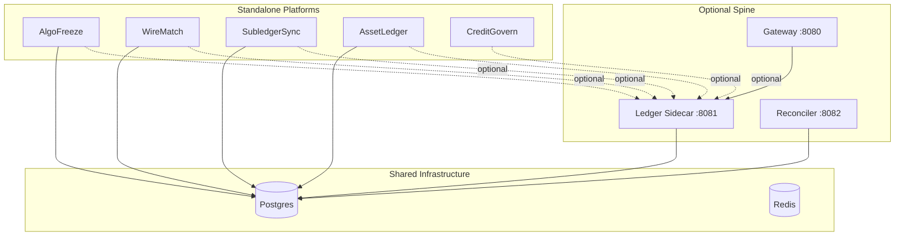
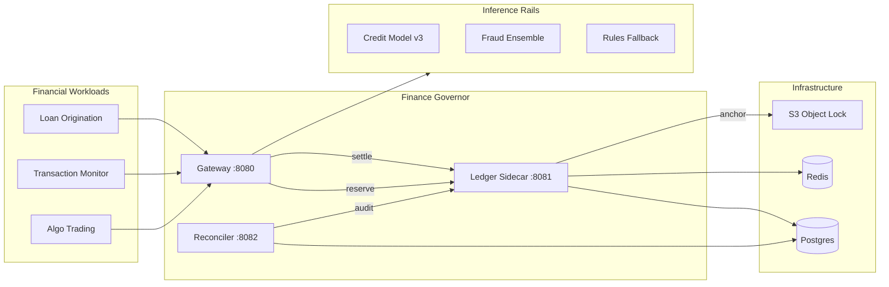

# Finance Governor Architecture

Two layers: an **optional spine** (shared control plane) and **standalone platforms** (each deployable alone).

See [platform-model.md](platform-model.md) for deployment modes.

## Layered architecture



**Standalone:** Each platform box runs with its own Postgres schema + services. Dotted lines to spine are disabled.

**Spine-connected:** Platforms call `spine_adapter.reserve/settle/emit_event` for unified audit and cross-platform invariants.

## System context (spine-connected)



## Service responsibilities

### Gateway (`finance-governor/gateway/`)

| Responsibility | ModelGovernor analog |
|----------------|---------------------|
| OIDC termination | Same — `auth_oidc.py` pattern |
| Protocol normalization | OpenAI-compat → **Finance Decision API** (JSON schema per instrument) |
| Orchestration | `governance.py`: reserve → dispatch → settle |
| Rail dispatch | Provider SDK → **inference rail HTTP/gRPC** |
| Cost/exposure estimate | `pricing.py` → `exposure_estimator.py` |

**Finance Decision API** (proposed):

```
POST /v1/decisions/credit/score
POST /v1/decisions/fraud/screen
POST /governed/decision   # full lifecycle wrapper
```

### Ledger Sidecar (`finance-governor/sidecar/`)

All decision-state mutations occur here inside Postgres transactions.

| Module | ModelGovernor source | Finance adaptation |
|--------|---------------------|-------------------|
| `ledger.py` | `sidecar/app/ledger.py` | `decision_ledger.py` — exposure reserve/settle |
| `finance_ops.py` | Same | `regulatory_ops.py` — finance invariants |
| `ledger_seal.py` | Same | `decision_seal.py` |
| `attribution.py` | Same | + desk/book/application dimensions |
| `policy.py` | Model allowlist | Instrument + jurisdiction policy |
| `guardrails.py` | Rate/concurrency | Per-desk inference limits |
| `diagnostic_mode.py` | Same | Same semantics |
| `money.py` | Micro-token quantum | `currency.py` — ISO 4217, NUMERIC(24,12) |

**Mutation endpoints:**

```
POST /reserve     # Hold exposure budget before inference
POST /settle      # Terminal decision with explanation binding
POST /adjudicate  # Manual resolution of STRANDED (compliance role)
```

**Read endpoints (internal auth):**

```
GET /internal/account/{account_id}
GET /internal/decision/{idempotency_key}
GET /internal/exposure/{scope_id}
GET /internal/events/recent
GET /internal/decisions/verify-chain
GET /internal/attribution/summary
GET /internal/guardrail/incidents
GET /internal/lineage/{idempotency_key}
GET /internal/regulatory/export
```

### Reconciler (`finance-governor/reconciler/`)

| Behavior | Finance note |
|----------|--------------|
| Leader election | Postgres advisory lock (unchanged) |
| Expired `RESERVED` | Refund exposure **only if** policy allows auto-expire |
| `IN_FLIGHT` / `PROVIDER_TIMEOUT` | → `STRANDED` (mandatory for high-risk) |
| Post-sweep audit | `assert_regulatory_ops_invariants()` |
| Standby CronJob | Same K8s pattern |

---

## Request lifecycle — credit decision

### 1. Reserve before inference

1. Client sends credit application context to gateway
2. Gateway forwards to sidecar `/reserve`
3. Sidecar validates: OIDC identity, schema, `instrument_policy_registry`, jurisdiction
4. Sidecar checks Redis guardrails (desk rate limit, concurrent in-flight)
5. Sidecar estimates exposure reservation (loan amount × approval probability bound)
6. Postgres transaction:
   - Enforce idempotency (`idempotency_key` + fingerprint)
   - Atomic update `exposure_budget_state` (desk/day cap)
   - Debit `account_ledgers` exposure wallet
   - Insert `decision_escrow_ledger` row `RESERVED`
   - Append `RESERVE_CREATED` to `decision_events`
7. Gateway dispatches to inference rail only after commit

### 2. In-flight inference

1. Gateway records `inference_rail_attempt` with `dispatch_attempt_key`
2. Status → `IN_FLIGHT`
3. Timeout → `PROVIDER_TIMEOUT` (not failure)
4. Failover to rules fallback under same logical operation

### 3. Settlement

1. Gateway calls `/settle` with score, decision, `explanation_artifact_id`
2. Sidecar locks row, validates settlement identity
3. Computes exposure drift (approved amount vs reserved)
4. Material drift → wallet/desk lock + `DRIFT_ENFORCED` event
5. Append `SETTLED_FINAL` or `RECONCILED_LATE_SETTLE`
6. Emit bias cohort counter if configured

### 4. Expiry and repair

1. Reconciler claims expiring rows (`FOR UPDATE SKIP LOCKED`)
2. Never-dispatched + low-risk → `EXPIRED` + exposure refund
3. High-risk or dispatched → `STRANDED` until adjudication
4. Append reason-coded events only — never rewrite history

---

## Core invariants (institutional++)

| # | Invariant | Enforcement |
|---|-----------|-------------|
| 0 | **No commit without Crystal (CCP)** | `surprise_commit_blocked_total` = 0 |
| 0b | **Horizon expiry → STRAND (critical/high)** | `crystal_horizon_strand_total` |
| 1 | No negative exposure balances | DB CHECK + `regulatory_ops` probe |
| 2 | No exposure cap overrun | Atomic UPDATE on `exposure_budget_state` |
| 3 | No duplicate settlements | Unique index + event probe |
| 4 | High-risk never silent-expire | Policy flag + reconciler logic |
| 5 | Settlement identity match | `validate_settlement_identity` |
| 6 | Model version = registered version | Policy check on reserve |
| 7 | Append-only decision events | No UPDATE/DELETE; hash chain |
| 8 | Single reconciler leader | Advisory lock |
| 9 | Postgres sole SoT for decisions | Redis volatile only |
| 10 | Reserve before inference | Gateway cannot bypass sidecar |

---

## Data layer

### Postgres (source of truth)

- `account_ledgers` — exposure/credit wallets per entity
- `decision_escrow_ledger` — per-decision state machine
- `decision_events` — append-only audit + hash chain
- `exposure_budget_state` — desk/book/tenant/day caps
- `instrument_policy_registry` — model + jurisdiction + risk tier
- `inference_rail_attempts` — multi-vendor failover
- `model_ownership` — accountability registry
- `guardrail_incidents` — approval, bias, version mismatch
- `decision_lineage` — feature snapshot hashes, prompts
- `admin_audit_log` — privileged mutations
- `decision_chain_anchors` — external S3 head hashes

### Redis (volatile only)

- Per-desk rate limits
- Concurrent inference caps
- Circuit breaker windows
- Diagnostic mode flag (cluster-wide write halt)

---

## Deployment topology

Copy ModelGovernor deployment kit verbatim with namespace rename:

| Artifact | Path pattern |
|----------|--------------|
| Docker Compose | `finance-governor/docker-compose.yml` |
| Kustomize base | `finance-governor/deploy/base/` |
| Overlays | staging / production / enterprise |
| Helm chart | `finance-governor/deploy/helm/financegovernor/` |
| ArgoCD | `finance-governor/deploy/argocd/` |
| Prometheus rules | SLO + invariant alerts |
| CronJobs | Chain verify, synthetic credit probe |

### Enterprise overlay additions

- Istio STRICT mTLS (same as ModelGovernor enterprise)
- Egress allowlist for inference rails only
- ExternalSecrets for DB, OIDC, S3 anchor credentials
- PgBouncer transaction pooling
- Redis Sentinel

---

## Tech stack

Unchanged from ModelGovernor — portability by design:

| Layer | Choice |
|-------|--------|
| Language | Python 3.12 |
| API | FastAPI + Pydantic v2 |
| DB | PostgreSQL 16 + SQLAlchemy 2.0 |
| Cache | Redis 7 |
| Auth | OIDC/JWT + internal token |
| Observability | Prometheus + OpenTelemetry |
| Anchoring | S3 Object Lock (boto3) |
| Packaging | Docker, K8s, Helm, ArgoCD |

---

## Adaptive reservation for finance

ModelGovernor's **Adaptive Reservation Sizing** ports directly:

- Statistical exposure estimate per product cohort
- Conservative fallback when approval variance is high
- Drift measurement: reserved exposure vs funded amount
- Auditable uplift only for approved low-risk segments

See `docs/adaptive-reservation.md` in ModelGovernor — replace "tokens" with "notional exposure units."

---

## Repository layout (target)

```
finance-governor/
├── spine/                    # Optional — gateway, sidecar, reconciler
│   ├── gateway/
│   ├── sidecar/
│   └── reconciler/
├── platforms/                # Each deployable standalone
│   ├── common/               # spine_adapter, events, money
│   ├── algofreeze/
│   ├── wire_match/
│   ├── subledger_sync/
│   ├── asset_depreciation/
│   └── credit_govern/
├── programs/                 # Test + demo per platform
└── docs/finance-governor/
```

Each `platforms/<name>/` includes:
- `docker-compose.standalone.yml` — no spine required
- `docker-compose.spine.yml` — overlay connecting to spine
- `migrations/`, `tests/`, `README.md`

Phase 0 (current): design docs + program specs in `programs/`.

Phase 1: scaffold **AlgoFreeze** standalone first (highest $/minute risk), then spine.
