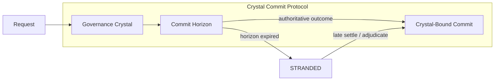
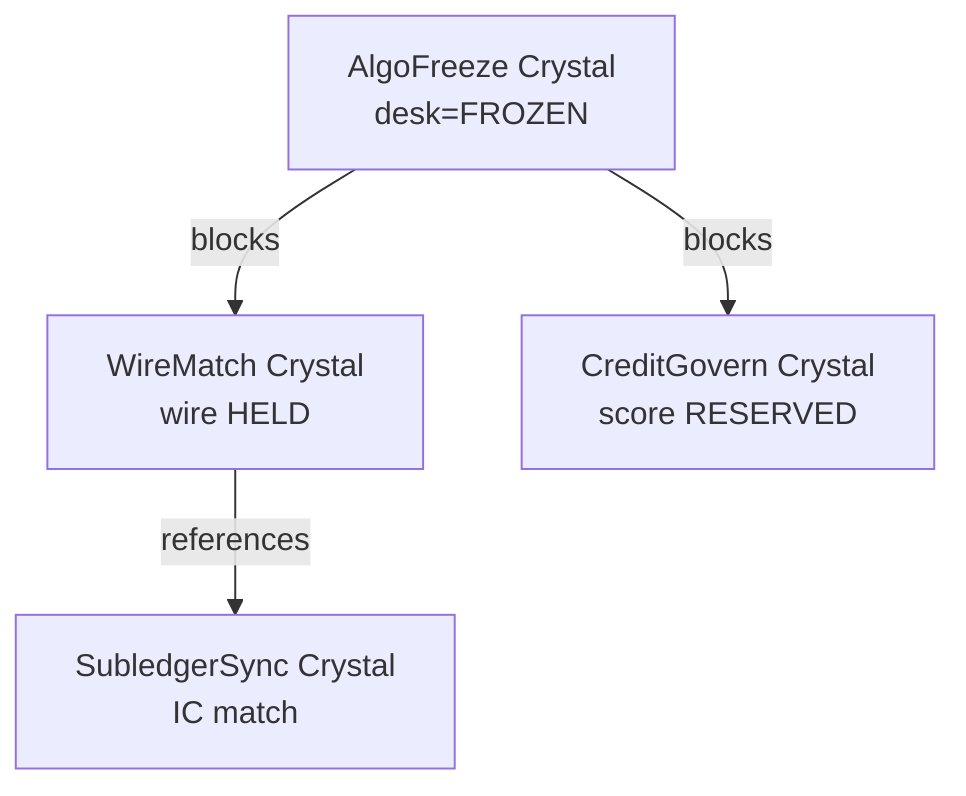

# Crystal Commit Protocol (CCP)

**Finance Governor's unique IP** — a cross-platform primitive that no MRM suite, payment hub, or reconciliation vendor productizes end-to-end.

> **No financial surprise is allowed to commit without a Crystal.**

A **Crystal** is an immutable, hash-chained snapshot of the world **at the moment you decide to act** — policy version, deploy SHA, FX rate, feed health, model registry state — bound to a **Commit Horizon** after which ambiguous outcomes **strand**, never guess.

CCP unifies AlgoFreeze, WireMatch, SubledgerSync, AssetLedger, and CreditGovern under one semantic model competitors do not share.

---

## Why CCP exists

Finance failures share one root cause: **the system committed when it did not know enough**.

| Incident | What committed without a Crystal |
|----------|----------------------------------|
| Knight Capital | Orders egressed on wrong code version — no frozen policy snapshot |
| Citigroup wire | Payment sent without crystallized beneficiary match score |
| Credit timeout | Unknown approve/deny — systems guess or silently expire |
| IC drift | Matched months later without FX rate at clear-time |
| Stale depreciation | Year-end batch without pinned regulatory table version |

Post-hoc logs answer *what happened*. Crystals answer ***under exactly which governed conditions was commitment authorized*** — reconstructable years later without re-running models or markets.

---

## The three primitives



### 1. Governance Crystal

At **gate / freeze / reserve** time, the platform **crystallizes** context into an append-only record:

```json
{
  "crystal_id": "crys_8f3a…",
  "crystal_hash": "sha256:…",
  "prev_crystal_hash": "sha256:…",
  "platform": "wire_match",
  "risk_tier": "high",
  "crystallized_at": "2026-06-25T14:32:01.123Z",
  "facets": {
    "policy_version": "wire-policy-v4.2",
    "semantic_match_score": 0.97,
    "amount_decimal": "7800000.00",
    "currency": "USD",
    "beneficiary_hash": "sha256:…",
    "golden_record_version": "gr_2026-06-01",
    "operator_id": "treasury-bot-3"
  },
  "parent_crystal_id": null
}
```

**Facets are platform-specific** but the Crystal envelope is universal.

| Platform | Crystallized facets |
|----------|---------------------|
| **AlgoFreeze** | `deploy_sha`, `approved_sha`, `feed_health_vector`, `desk_id`, `freeze_policy_version` |
| **WireMatch** | `semantic_score`, `golden_record_version`, `amount_quantum`, `beneficiary_hash` |
| **SubledgerSync** | `fx_rate_hash`, `fx_source`, `txn_hash_a`, `txn_hash_b`, `tolerance_bps` |
| **AssetLedger** | `reg_table_version`, `reg_table_effective_date`, `asset_book_value`, `method` |
| **CreditGovern** | `model_version_id`, `feature_snapshot_hash`, `exposure_reserved`, `jurisdiction` |

Crystals are **hash-chained** (same machinery as ModelGovernor `ledger_seal.py`). Tamper = broken chain = examiner alarm.

---

### 2. Commit Horizon

Every Crystal carries a **Commit Horizon** — a risk-tiered TTL for authoritative outcome.

```
horizon_expires_at = crystallized_at + policy.commit_horizon_ms(risk_tier)
```

| Risk tier | Typical horizon | On expiry (CCP rule) |
|-----------|-----------------|----------------------|
| **Critical** (algo egress, high-value wire) | 5s – 60s | **STRAND** — never auto-commit, never silent refund |
| **High** (credit decision, IC match) | 60s – 15m | **STRAND** — compliance adjudication |
| **Standard** (low-value wire, routine depreciation) | 15m – 24h | **EXPIRE** or STRAND per policy flag |

**CCP non-negotiable:** Critical and High tiers **never** resolve ambiguity by guessing. Knight-class incidents are horizon violations treated as strand, not retry loops.

This is **Temporal Stranding** — ModelGovernor's `STRANDED` semantics elevated to a **first-class protocol**, not an implementation detail.

---

### 3. Crystal-Bound Commit

No irreversible action proceeds without:

1. Valid `crystal_id`
2. `commit_fingerprint` matching crystal facets
3. Horizon not expired **OR** explicit `RECONCILED_LATE_SETTLE` / `ADJUDICATED` path

```python
# Conceptual — all platforms share this shape
def commit(action: IrreversibleAction) -> CommitResult:
    crystal = crystals.get(action.crystal_id)
    if crystal is None:
        return CommitResult.DENIED_NO_CRYSTAL
    if not fingerprint_matches(action, crystal.facets):
        return CommitResult.DENIED_FINGERPRINT_MISMATCH
    if crystal.is_expired() and not action.has_late_authority():
        return CommitResult.STRANDED_HORIZON_EXCEEDED
    return ledger.append_commit(action, crystal_id=crystal.id)
```

**Surprise Budget = 0:** Any commit without crystal or with facet drift increments `surprise_commit_blocked_total` — zero error budget invariant.

---

## Adaptive Crystal Sizing (capital efficiency edge)

Port ModelGovernor's **Adaptive Reservation Sizing** into CCP as **Adaptive Crystal Sizing**:

- Crystal records not just *whether* to act but *how much exposure* to bind
- Statistical bounds per cohort (credit approval probability, algo batch notional)
- Conservative fallback when cohort history is sparse or drift is high
- All bounds **inside** the crystal — examiner sees exact reservation logic at T0

```
ModelGovernor:  reserve tokens before LLM dispatch
Finance Governor: crystallize exposure before credit score / algo batch / wire hold
```

**Unique blend:** MRM tools validate models; CCP **crystallizes capital commitment** with adaptive bounds — capital efficiency **and** institutional control.

---

## Crystal Mesh (cross-platform uniqueness)

When spine-connected, Crystals form a **mesh** — parent/child links across platforms:



**Mesh invariants (zero budget):**

| Rule | Meaning |
|------|---------|
| `FROZEN` desk crystal | No child wire/credit crystal may commit |
| Wire crystal `SETTLED` | SubledgerSync match must reference same `wire_ref_hash` |
| Credit crystal `STRANDED` | No downstream funding crystal may commit |

No competitor sells programmable **cross-domain crystal invariants** — this is spine-only moat.

---

## Forensic Reconstruction (examiner superpower)

Given `crystal_id`, reconstruct **full decision context** without:

- Re-running credit models
- Replaying markets
- Re-querying live FX feeds

```
GET /internal/crystals/{crystal_id}/reconstruct
→ policy text hash, facet snapshot, chain position, linked commits, horizon timeline
```

**Examiner question:** "Prove you didn't approve this loan on the wrong model version."

**Answer:** Crystal facet `model_version_id` + hash chain + no commit without matching crystal.

This is **Replay-Safe Governance** — unique to CCP + ModelGovernor spine.

---

## Schema (spine + platform)

```sql
CREATE TABLE governance_crystals (
    crystal_id VARCHAR(255) PRIMARY KEY,
    platform VARCHAR(50) NOT NULL,
    operation_id VARCHAR(255) NOT NULL,
    risk_tier VARCHAR(20) NOT NULL,
    facets JSONB NOT NULL,
    crystal_hash VARCHAR(64) NOT NULL,
    prev_crystal_hash VARCHAR(64),
    parent_crystal_id VARCHAR(255),
    horizon_expires_at TIMESTAMPTZ NOT NULL,
    terminal_state VARCHAR(50),  -- COMMITTED | STRANDED | EXPIRED | ADJUDICATED
    crystallized_at TIMESTAMPTZ NOT NULL DEFAULT CURRENT_TIMESTAMP
);

CREATE INDEX idx_crystals_horizon_sweep
ON governance_crystals (terminal_state, horizon_expires_at)
WHERE terminal_state IS NULL;
```

Platforms without spine use local `platform_crystals` with identical envelope.

---

## CCP lifecycle (all platforms)

```
1. CRYSTALLIZE   → gate / freeze / reserve (facets + horizon + hash)
2. IN_FLIGHT     → action dispatched (order, wire, score, match, depreciate)
3. COMMIT        → crystal-bound terminal (settle, send, approve, post)
   OR STRAND     → horizon expired, ambiguous, or mesh block
   OR ADJUDICATE → human/compliance resolution with new adjudication crystal
4. LATE_COMMIT   → RECONCILED_LATE_SETTLE with original crystal_id preserved
```

---

## What competitors lack (CCP-specific)

| Competitor class | They have | CCP adds |
|------------------|-----------|----------|
| MRM (ValidMind) | Model cards, validation reports | Runtime crystal at inference T0 |
| Observability (Fiddler) | Drift dashboards | Crystal-bound commit gate |
| Payments (Finastra) | Message validation | Semantic facets + horizon strand |
| Reconciliation (BlackLine) | Batch match | FX facet crystallized at clear |
| Trade surveillance | Post-trade patterns | Pre-egress freeze crystal |
| GRC (ServiceNow) | Policy documents | Executable policy **in** crystal facets |

**No one packages:** crystallize → horizon → strand → mesh → reconstruct as **one protocol**.

---

## Branding & messaging

| Phrase | Use |
|--------|-----|
| **Crystal Commit Protocol** | Technical / architectural |
| **"No commit without a Crystal"** | Elevator pitch |
| **Surprise Budget = 0** | Invariant / SLO language |
| **Temporal Stranding** | Horizon expiry behavior |
| **Crystal Mesh** | Enterprise multi-platform upsell |
| **Forensic Reconstruction** | Examiner / model risk sales |

### Elevator pitch

> Finance Governor implements the **Crystal Commit Protocol**: every irreversible financial action must bind to an immutable snapshot of policy, version, and market context — with a hard time horizon that **strands** ambiguity instead of guessing. It's how you prevent the next Knight or Citigroup wire **in software**, with proof an examiner can reconstruct five years later.

---

## Implementation path

| Phase | Deliverable |
|-------|-------------|
| **1** | `governance_crystals` table + `crystallize()` in AlgoFreeze + WireMatch |
| **2** | Horizon sweeper in reconciler (strand on expiry) |
| **3** | `GET /internal/crystals/{id}/reconstruct` |
| **4** | Adaptive Crystal Sizing in CreditGovern |
| **5** | Crystal Mesh invariants (spine-connected) |
| **6** | `make crystal-demo` — 3-minute CCP walkthrough |

---

## Related

- [platform-model.md](platform-model.md) — standalone vs spine
- [institutional-gold-standard.md](institutional-gold-standard.md) — Surprise Budget = 0
- [competitive-landscape.md](competitive-landscape.md) — vs incumbents
- ModelGovernor: `ledger_seal.py`, adaptive reservation, `STRANDED` semantics
