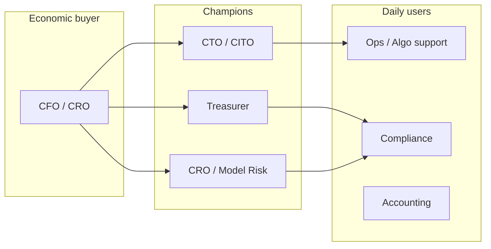

# Desirability Deep Dive — Why Finance Governor Wins

Why regulated institutions **want** these platforms — not just need them — and how desirability compounds across standalone deploys and spine bundles.

## The desirability thesis

Finance teams do not buy infrastructure for elegance. They buy when **three forces align**:

1. **Pain is quantifiable** — board-level numbers, not vague "efficiency"
2. **Failure is career-ending or firm-threatening** — urgency to act
3. **Alternative is worse** — build (slow, risky), buy incumbent (post-hoc, monolithic), or do nothing (unacceptable to regulators)

Finance Governor platforms hit all three. Each standalone product has a **single-line ROI story**; the spine bundle adds **examiner-grade unification** that no stitched-together stack provides.

---

## Macro drivers (2025–2027)

| Driver | Effect on desirability |
|--------|------------------------|
| **EU AI Act high-risk enforcement** | Credit scoring, insurance pricing, employment decisions require runtime governance evidence — not just model cards |
| **FCA / OCC / CFPB AI guidance** | UK and US regulators expect ongoing monitoring, explainability, accountability — production proof, not policy PDFs |
| **Algo incident memory** | Knight Capital, Citigroup wire, Flash Crash — boards ask "could this happen to us?" |
| **Talent scarcity** | Cannot hire 20 engineers to build ledger + reconciler + audit chain per domain |
| **GenAI expansion into finance** | Credit copilots, fraud LLMs, document extraction — governance gap widens faster than MRM can close |
| **Audit cost inflation** | Big Four fees up; CFOs want **prevention at transaction clear**, not discovery at year-end |

**Desirability window:** Institutions are budgeting for AI governance in 2025–2026 but have not standardized on runtime control planes. First mover with **demo-proven** institutional++ wins design-partner and reference-customer advantage.

---

## Platform-by-platform desirability

### AlgoFreeze — "Could Knight Capital happen to us?"

| Dimension | Detail |
|-----------|--------|
| **Quantified pain** | Knight: ~$440M in ~45 min; flash events routinely cost $10M–$100M+ |
| **Emotional hook** | CTO/CRO fear — one bad deploy ends careers |
| **Buyer champion** | Head of Electronic Trading, CRO, CTO |
| **Budget line** | Market risk technology, algo oversight, operational resilience |
| **Why now** | CI/CD velocity ↑; deploy frequency ↑; version drift risk ↑ |
| **Standalone appeal** | Deploy in front of EMS in days; no firm-wide transformation |
| **Spine appeal** | Prove to regulators that freeze events are immutable and cross-correlated with payment controls |

**ROI sketch:**

```
Cost of one preventable incident:     $50M–$440M (tail risk)
AlgoFreeze annual platform cost:      $150K–$400K (target ACV)
Break-even:                           Preventing 0.001 incidents/year
```

**Desirability score:** ⭐⭐⭐⭐⭐ — highest urgency, shortest sales cycle for standalone.

---

### WireMatch — "Never send the $900M wire"

| Dimension | Detail |
|-----------|--------|
| **Quantified pain** | Citigroup/Revlon: ~$900M vs ~$7.8M intended; industry wire errors: billions aggregate annually |
| **Emotional hook** | Treasury nightmares — irreversible, embarrassing, litigious |
| **Buyer champion** | Group Treasurer, Head of Payments, CCO |
| **Budget line** | Payments transformation, operational risk, RegTech |
| **Why now** | ISO 20022 migration opens schema-normalization window; NLP maturity enables semantic gate |
| **Standalone appeal** | Gate before SWIFT/API — no core banking replacement |
| **Spine appeal** | Wire reserve + settle links payment to intercompany reconciliation |

**ROI sketch:**

```
Single prevented fat-finger wire:     $1M–$900M
Manual reconciliation FTE cost:         $500K–$2M/year (mid-size bank)
WireMatch annual platform cost:         $200K–$500K (target ACV)
```

**Desirability score:** ⭐⭐⭐⭐⭐ — universal treasury pain; demo is visceral (show HELD wire).

---

### SubledgerSync — "Stop paying auditors to find what code could find"

| Dimension | Detail |
|-----------|--------|
| **Quantified pain** | Multi-entity groups: $2M–$10M+ annual audit inefficiency; tax leakage from undetected IC drift |
| **Emotional hook** | CFO frustration — "why do we learn this in March for December?" |
| **Buyer champion** | Group CFO, Controller, Head of Tax |
| **Budget line** | Finance transformation, shared services, ERP modernization |
| **Why now** | Multi-jurisdiction complexity ↑; real-time FX APIs cheap; graph/async tooling mature |
| **Standalone appeal** | Event pipeline beside ERP — no rip-and-replace |
| **Spine appeal** | IC match events feed group invariant audit |

**ROI sketch:**

```
Audit fee reduction (10–20%):           $200K–$1M/year
Tax efficiency recovered:               Highly variable; often $500K+
SubledgerSync annual platform cost:     $150K–$350K (target ACV)
Payback:                                Often < 12 months
```

**Desirability score:** ⭐⭐⭐⭐ — strong CFO pull; longer ERP integration cycle than AlgoFreeze.

---

### AssetLedger — "Books wrong every quarter is not acceptable"

| Dimension | Detail |
|-----------|--------|
| **Quantified pain** | Overstated assets → tax overpayment, SEC/FCA misstatement risk, restatement cost |
| **Emotional hook** | Controller credibility — "our depreciation is always behind" |
| **Buyer champion** | Controller, Chief Accountant, Tax Director |
| **Budget line** | Close automation, fixed asset management |
| **Why now** | HMRC/IRS digital APIs; cron-driven automation is boring but board-friendly |
| **Standalone appeal** | Asset registry + engine — no ERP replacement |
| **Spine appeal** | Regulatory table version pinned in audit chain for exam |

**ROI sketch:**

```
Tax overpayment from stale books:       $100K–$5M+ (entity size dependent)
Manual FTE for year-end write-offs:     $80K–$300K/year
AssetLedger annual platform cost:       $100K–$250K (target ACV)
```

**Desirability score:** ⭐⭐⭐ — steady, less dramatic than AlgoFreeze/WireMatch; easier retain.

---

### CreditGovern — "Regulators are coming for production AI credit"

| Dimension | Detail |
|-----------|--------|
| **Quantified pain** | Fair lending consent orders: $10M–$100M+; EU AI Act fines up to 7% global turnover |
| **Emotional hook** | CRO + General Counsel — personal liability under FCA SMCR |
| **Buyer champion** | CRO, Model Risk, Consumer Lending CTO |
| **Budget line** | Model risk management, RegTech, AI governance |
| **Why now** | EU AI Act high-risk timeline; CFPB adverse action scrutiny on ML |
| **Standalone appeal** | Gate before credit model — beside existing LOS |
| **Spine appeal** | Full regulatory export pack for exam |

**ROI sketch:**

```
Single fair lending enforcement:        $10M–$50M+
MRM manual evidence assembly:           $500K–$2M/year
CreditGovern annual platform cost:      $250K–$600K (target ACV)
```

**Desirability score:** ⭐⭐⭐⭐ — high strategic value; longer procurement (MRM involvement).

---

## Buyer persona map



| Persona | Cares about | Lead platform |
|---------|-------------|---------------|
| **CRO** | Tail risk, regulatory tail | AlgoFreeze, CreditGovern |
| **CFO** | Audit cost, book accuracy | SubledgerSync, AssetLedger |
| **Treasurer** | Irreversible payment error | WireMatch |
| **CTO** | Deploy velocity without blow-up | AlgoFreeze |
| **CCO / Compliance** | Examiner evidence | Spine bundle |
| **Model Risk** | SR 11-7, EU AI Act proof | CreditGovern + spine |

---

## Why build fails, why incumbents disappoint

| Alternative | Why desirability for Finance Governor is higher |
|-------------|------------------------------------------------|
| **In-house build** | 12–24 eng-months per platform for ledger + reconciler + audit; most banks never finish |
| **ERP module** | Batch, post-hoc; not pre-execution; 18-month implementation |
| **MLOps platform** | Experiment tracking ≠ runtime financial control |
| **GRC suite** | Policy docs ≠ sub-second freeze or wire gate |
| **Consulting SOW** | No running code; no `make demo-gold` proof |
| **Cloud AI guardrails** | Content safety; not wire matching or exposure reserve |

**Moat:** Proven institutional++ spine (from ModelGovernor) × finance-specific clean codebases × standalone time-to-value.

---

## Bundle desirability — the spine upsell

| Stage | Customer state | Upsell |
|-------|----------------|--------|
| 1 | Deployed AlgoFreeze standalone | "Add WireMatch — same freeze audit stream" |
| 2 | Two platforms | "Spine-lite: unified hash chain, one examiner export" |
| 3 | Three+ platforms | "Full spine: cross-platform invariants (no wire while desk frozen)" |
| 4 | Enterprise | "Platform D security: mTLS, egress allowlist, S3 anchor" |

**Bundle ACV target (when sold):**

| Bundle | Platforms | Target ACV/year |
|--------|-----------|-----------------|
| **Risk Critical** | AlgoFreeze + WireMatch | $400K–$800K |
| **Finance Ops** | SubledgerSync + AssetLedger | $300K–$600K |
| **Regulated AI** | CreditGovern + spine | $500K–$1M |
| **Enterprise Full** | All five + spine + security | $1M–$2.5M |

---

## Pre-revenue asset desirability (investor / M&A lens)

Finance Governor inherits ModelGovernor's **proven institutional++ engineering** and applies it to **larger TAM** (all of regulated finance vs LLM spend only).

| Asset | Pre-revenue worth driver |
|-------|--------------------------|
| ModelGovernor spine (ported) | $900K–$1.6M replacement cost (proven) |
| Five platform specs + domain schema | $400K–$800K |
| Demo-ready standalone paths (when built) | $300K–$600K each at maturity |
| **Finance Governor bundle (design + spine IP)** | **$5M–$10M** fair value at full scaffold |

**Strategic acquirer premium:** RegTech, core banking, market infrastructure — buyers pay for **runtime control plane** IP, not another dashboard.

---

## Sales motion by desirability tier

| Tier | Platform | Motion | Proof artifact |
|------|----------|--------|----------------|
| **1 — Land fast** | AlgoFreeze, WireMatch | 30-day pilot, single team | `make algofreeze-demo` — freeze in <100ms |
| **2 — Expand** | SubledgerSync, AssetLedger | CFO-sponsored, 60–90 day | Discrepancy caught at clear, not audit |
| **3 — Strategic** | CreditGovern + spine | MRM + Legal, 6–12 month | Regulatory export + chain verify |
| **4 — Enterprise** | Full bundle + security | CISO + procurement | K8s overlay, Istio, SOC2 evidence pack |

---

## Objection handling

| Objection | Response |
|-----------|----------|
| "We already have MRM" | MRM validates models; we enforce at runtime. Complementary. |
| "Too narrow" | Each platform is narrow **by design** — clean code, fast deploy. Spine unifies. |
| "We can use our ERP" | ERP is batch post-hoc. We gate **before** wire fires or order egresses. |
| "AI governance is hype" | Knight and Citigroup were not AI — they were **control plane failures**. Same primitives. |
| "Build vs buy" | Show 57+ tests, hash chain, reconciler HA — ask their eng lead for timeline to match. |

---

## Desirability summary matrix

| Platform | Pain $ | Urgency | Standalone speed | Champion strength | **Overall** |
|----------|--------|---------|------------------|-------------------|-------------|
| AlgoFreeze | Extreme | Extreme | Days | CTO/CRO | ⭐⭐⭐⭐⭐ |
| WireMatch | Extreme | High | Weeks | Treasurer | ⭐⭐⭐⭐⭐ |
| SubledgerSync | High | Medium | Weeks | CFO | ⭐⭐⭐⭐ |
| AssetLedger | Medium | Medium | Weeks | Controller | ⭐⭐⭐ |
| CreditGovern | High | Rising | Months | CRO/MRM | ⭐⭐⭐⭐ |
| **Spine bundle** | N/A | High (exams) | After 2+ platforms | CCO | ⭐⭐⭐⭐ |

**Recommended GTM:** Lead with **AlgoFreeze** or **WireMatch** (visceral demo, fast yes), expand to spine as second platform lands.
