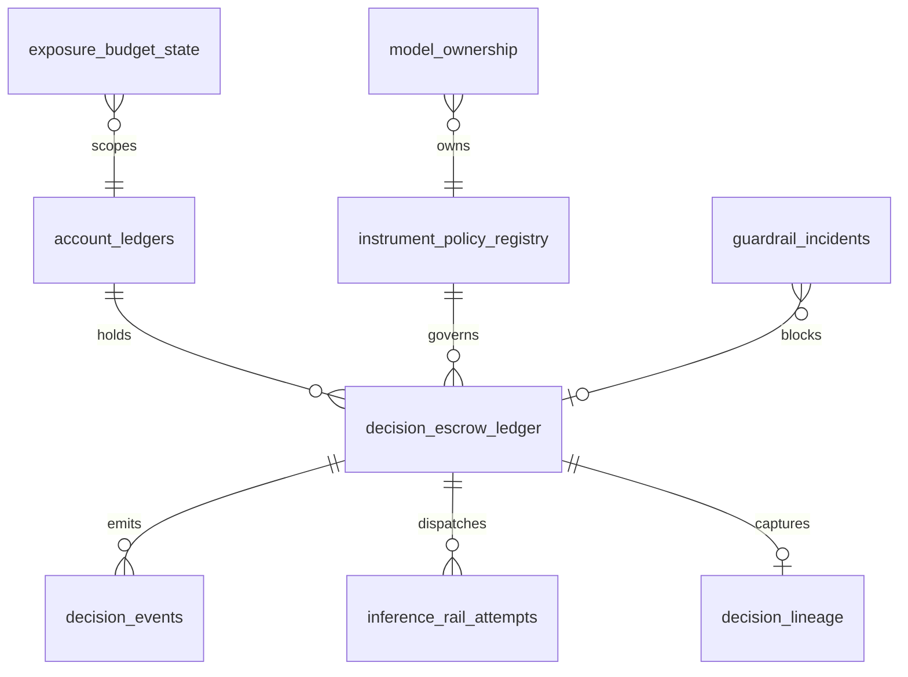

# Finance Governor Domain Model

Table-by-table mapping from ModelGovernor to Finance Governor, with proposed initial schema for the credit decision wedge.

## Entity relationship (conceptual)



---

## Table mapping

| ModelGovernor | Finance Governor | Key differences |
|---------------|------------------|-----------------|
| `user_wallets` | `account_ledgers` | `ledger_type`: exposure, nostro, fee; `currency` ISO 4217 |
| `model_policy_registry` | `instrument_policy_registry` | + jurisdiction, risk_tier, explainability_required |
| `escrow_ledger` | `decision_escrow_ledger` | + application_id, approved_amount, decision_outcome |
| `ledger_events` | `decision_events` | + compliance metadata, explanation_artifact_id |
| `trace_budget_state` | `exposure_budget_state` | scope: desk, book, tenant, product, day |
| `provider_dispatch_attempts` | `inference_rail_attempts` | rail_type: ml_model, rules_engine, vendor_api |
| `execution_lineage` | `decision_lineage` | feature_snapshot_hash, model_input_hash |
| `budget_scope_state` | `exposure_scope_state` | notional caps not token caps |
| `guardrail_incidents` | `guardrail_incidents` | + BIAS_THRESHOLD, JURISDICTION_VIOLATION |
| `admin_audit_log` | `admin_audit_log` | same pattern |
| `ledger_chain_anchors` | `decision_chain_anchors` | same pattern |

---

## Proposed schema (Phase 1 — credit wedge)

### account_ledgers

```sql
CREATE TABLE account_ledgers (
    account_id VARCHAR(255) NOT NULL,
    ledger_type VARCHAR(50) NOT NULL,  -- exposure | nostro | fee
    currency CHAR(3) NOT NULL DEFAULT 'USD',
    balance NUMERIC(24, 12) NOT NULL DEFAULT 0,
    active BOOLEAN NOT NULL DEFAULT TRUE,
    lock_reason VARCHAR(255),
    locked_at TIMESTAMPTZ,
    updated_at TIMESTAMPTZ NOT NULL DEFAULT CURRENT_TIMESTAMP,
    PRIMARY KEY (account_id, ledger_type, currency),
    CONSTRAINT account_nonnegative_balance CHECK (balance >= 0)
);
```

### instrument_policy_registry

```sql
CREATE TABLE instrument_policy_registry (
    policy_id VARCHAR(255) PRIMARY KEY,
    instrument_type VARCHAR(50) NOT NULL,  -- credit | fraud | aml | trading
    model_version_id VARCHAR(255) NOT NULL,
    jurisdiction VARCHAR(10) NOT NULL,
    risk_classification VARCHAR(20) NOT NULL,  -- high | limited | minimal
    max_exposure_per_decision NUMERIC(24, 12) NOT NULL,
    max_auto_approve_amount NUMERIC(24, 12) NOT NULL,
    explainability_required BOOLEAN NOT NULL DEFAULT TRUE,
    allow_auto_expire BOOLEAN NOT NULL DEFAULT FALSE,
    inference_rail_primary VARCHAR(255) NOT NULL,
    inference_rail_fallback VARCHAR(255),
    enabled BOOLEAN NOT NULL DEFAULT TRUE,
    effective_from TIMESTAMPTZ NOT NULL,
    effective_to TIMESTAMPTZ,
    updated_at TIMESTAMPTZ NOT NULL DEFAULT CURRENT_TIMESTAMP
);
```

### decision_escrow_ledger

```sql
CREATE TYPE decision_status AS ENUM (
    'RESERVED', 'IN_FLIGHT', 'PROVIDER_TIMEOUT',
    'SETTLED', 'EXPIRED', 'STRANDED', 'ADJUDICATED'
);

CREATE TABLE decision_escrow_ledger (
    idempotency_key VARCHAR(255) PRIMARY KEY,
    account_id VARCHAR(255) NOT NULL,
    application_id VARCHAR(255) NOT NULL,
    instrument_type VARCHAR(50) NOT NULL,
    policy_id VARCHAR(255) NOT NULL REFERENCES instrument_policy_registry(policy_id),
    tenant_id VARCHAR(255) NOT NULL,
    desk_id VARCHAR(255),
    book_id VARCHAR(255),
    request_fingerprint VARCHAR(64) NOT NULL,
    reserved_exposure NUMERIC(24, 12) NOT NULL,
    approved_amount NUMERIC(24, 12) NOT NULL DEFAULT 0,
    decision_outcome VARCHAR(50),  -- approve | deny | refer | pending
    status decision_status NOT NULL DEFAULT 'RESERVED',
    explanation_artifact_id VARCHAR(255),
  feature_snapshot_hash VARCHAR(64),
    rail_request_id VARCHAR(255),
    terminal_reason VARCHAR(255),
    created_at TIMESTAMPTZ NOT NULL DEFAULT CURRENT_TIMESTAMP,
    expires_at TIMESTAMPTZ NOT NULL,
    settled_at TIMESTAMPTZ,
    expired_at TIMESTAMPTZ,
    reconciled BOOLEAN NOT NULL DEFAULT FALSE,
    CONSTRAINT decision_nonnegative_reserved CHECK (reserved_exposure >= 0),
    CONSTRAINT decision_nonnegative_approved CHECK (approved_amount >= 0)
);
```

### decision_events (append-only + hash chain)

```sql
CREATE TABLE decision_events (
    event_id BIGSERIAL PRIMARY KEY,
    idempotency_key VARCHAR(255) NOT NULL,
    account_id VARCHAR(255) NOT NULL,
    event_type VARCHAR(50) NOT NULL,
    exposure_delta NUMERIC(24, 12) NOT NULL,
    metadata JSONB NOT NULL DEFAULT '{}'::jsonb,
    prev_hash VARCHAR(64),
    row_hash VARCHAR(64) NOT NULL,
    recorded_at TIMESTAMPTZ NOT NULL DEFAULT CURRENT_TIMESTAMP
);
```

---

## Governance Crystal (CCP — cross-platform)

See [crystal-commit-protocol.md](crystal-commit-protocol.md). Every platform crystallizes context before irreversible action.

```sql
CREATE TABLE governance_crystals (
    crystal_id VARCHAR(255) PRIMARY KEY,
    platform VARCHAR(50) NOT NULL,
    operation_id VARCHAR(255) NOT NULL,
    risk_tier VARCHAR(20) NOT NULL,
    facets JSONB NOT NULL,
    crystal_hash VARCHAR(64) NOT NULL,
    prev_crystal_hash VARCHAR(64),
    parent_crystal_id VARCHAR(255),
    horizon_expires_at TIMESTAMPTZ NOT NULL,
    terminal_state VARCHAR(50),
    crystallized_at TIMESTAMPTZ NOT NULL DEFAULT CURRENT_TIMESTAMP
);
```

Standalone platforms use `platform_crystals` with identical envelope.

---

### exposure_budget_state

```sql
CREATE TABLE exposure_budget_state (
    scope_key VARCHAR(512) PRIMARY KEY,  -- e.g. tenant:desk:day:2026-06-25
    cap_amount NUMERIC(24, 12) NOT NULL,
    reserved_total NUMERIC(24, 12) NOT NULL DEFAULT 0,
    settled_total NUMERIC(24, 12) NOT NULL DEFAULT 0,
    updated_at TIMESTAMPTZ NOT NULL DEFAULT CURRENT_TIMESTAMP,
    CONSTRAINT exposure_cap_nonnegative CHECK (cap_amount >= 0),
    CONSTRAINT exposure_reserved_within_cap CHECK (reserved_total <= cap_amount)
);
```

---

## State machine

```
                    ┌─────────────┐
                    │   RESERVED  │
                    └──────┬──────┘
           dispatch        │         expiry (low-risk only)
              ┌────────────┼────────────┐
              ▼                         ▼
       ┌─────────────┐           ┌──────────┐
       │  IN_FLIGHT  │           │ EXPIRED  │
       └──────┬──────┘           └──────────┘
              │ timeout
              ▼
    ┌──────────────────┐
    │ PROVIDER_TIMEOUT │
    └────────┬─────────┘
             │ reconciler
             ▼
       ┌───────────┐     adjudicate     ┌─────────────┐
       │ STRANDED  │ ─────────────────► │ ADJUDICATED │
       └─────┬─────┘                    └─────────────┘
             │ late settle
             ▼
       ┌──────────┐
       │ SETTLED  │
       └──────────┘
```

---

## Event types

| Event | Meaning |
|-------|---------|
| `RESERVE_CREATED` | Exposure held, decision authorized to proceed |
| `INFERENCE_DISPATCHED` | Rail attempt started |
| `SETTLED_FINAL` | Terminal decision with explanation |
| `DRIFT_ENFORCED` | Approved amount exceeded tolerance → lock |
| `EXPIRED_SWEEP` | Safe expiry + exposure refund |
| `STRANDED_HOLD` | Ambiguous outcome, hold retained |
| `RECONCILED_LATE_SETTLE` | Authoritative outcome after strand |
| `MANUAL_ADJUDICATION` | Compliance officer resolution |
| `BIAS_ALERT` | Cohort threshold breach recorded |
| `GUARDRAIL_BLOCKED` | Approval required, jurisdiction, version mismatch |

---

## regulatory_ops invariants

Port `finance_ops.py` probes:

| Probe | SQL intent |
|-------|------------|
| `negative_balances` | `account_ledgers.balance < 0` |
| `exposure_cap_overruns` | `exposure_budget_state.reserved_total > cap_amount` |
| `duplicate_settlements` | Multiple `SETTLED_FINAL` per idempotency_key |
| `duplicate_refunds` | Multiple `EXPIRED_SWEEP` per key |
| `stranded_without_hold` | `STRANDED` but exposure refunded |
| `high_risk_auto_expired` | High-risk policy + `EXPIRED` without adjudication |
| `unapproved_above_threshold` | Settled approve > max_auto_approve without approval_id |
| `model_version_mismatch` | Settled model ≠ policy registry at reserve time |

---

## Identity and fingerprinting

**Idempotency key:** Client-supplied, unique per logical decision (e.g. `application_id + decision_type`).

**Request fingerprint:** SHA-256 of canonicalized:
- `application_id`
- `policy_id`
- `model_version_id`
- `feature_snapshot_hash`
- `tenant_id`

Settlement must present matching fingerprint dimensions or `attribution_identity_mismatch_total` increments.

---

## Money and precision

Reuse ModelGovernor `NUMERIC(24,12)` and quantum rounding from `money.py`:

- All exposure amounts stored as decimal, never float
- Currency-specific quantum in `currency.py` (USD: 0.01, JPY: 1)
- FX conversion (Phase 3): separate `fx_rate_snapshot_id` on reserve
