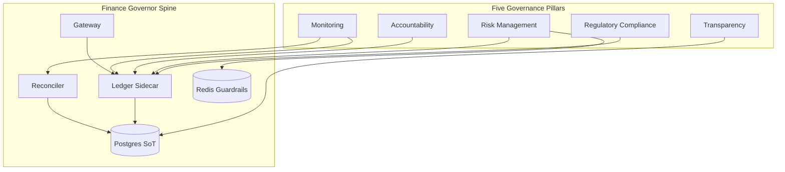
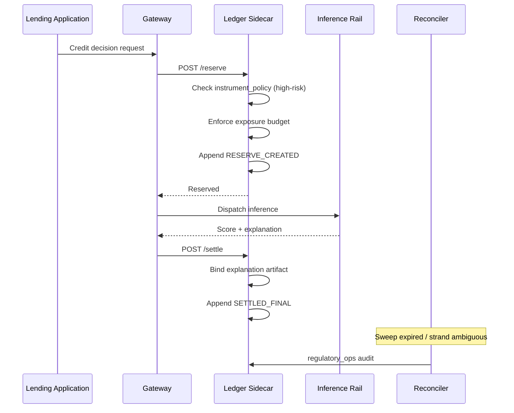

# Transferring AI Governance to Financial Services

Mapping the five governance pillars from ModelGovernor (and your regulatory framework) to Finance Governor components, controls, and evidence artifacts.

## Framework overview



---

## 1. Regulatory Compliance

**Requirement:** Adhere to EU AI Act, FCA AI guidance, SR 11-7, fair lending (ECOA/Reg B), AML (BSA/5AMLD), and firm-specific policies.

### ModelGovernor pattern → Finance adaptation

| Control | ModelGovernor | Finance Governor |
|---------|---------------|------------------|
| Allowlist enforcement | `model_policy_registry` | `instrument_policy_registry` — model version, product, jurisdiction, risk tier |
| Pre-action block | Policy check on `/reserve` | Policy check before inference; block unregistered high-risk models |
| High-risk classification | Cost caps, manual approval | Exposure caps, mandatory human-in-loop above threshold |
| Data residency | Deployment overlays | Jurisdiction tags on reserve; block cross-region inference for EU data |
| Regulatory export | Ledger events + verify API | Examiner pack: decision chain, policy version, bias snapshot |

### Implementation components

```
instrument_policy_registry
  - instrument_type: credit | fraud | pricing | aml | trading
  - model_version_id (must match production registry)
  - jurisdiction: EU | UK | US | ...
  - risk_classification: high | limited | minimal (EU AI Act mapping)
  - max_exposure_per_decision
  - explainability_required: boolean
  - bias_monitoring_cohort_fields: jsonb
  - enabled, effective_from, effective_to
```

### Regulatory mapping table

| Regulation | Finance Governor artifact |
|------------|---------------------------|
| EU AI Act Art. 9–15 (high-risk) | Risk management logs in `decision_events`; conformity from policy registry version |
| FCA AI DP5/23 | Accountability dimensions on every reserve; senior manager report exports |
| SR 11-7 (US) | Model version lock, challenger linkage, ongoing monitoring counters |
| ECOA / Reg B | Adverse action feature attribution in settlement metadata |
| BSA / AML | Screen reserve → settle → disposition chain; no silent expiry |

---

## 2. Risk Management

**Requirement:** Identify and mitigate risks — data sensitivity, bias, model drift, operational failures.

### Unique financial risks addressed

| Risk | Mitigation |
|------|------------|
| **Data sensitivity** | PII tokenization at gateway; no raw features in `decision_events` — store hashes + reference IDs |
| **Bias** | Cohort counters on settlement; threshold alerts on approval rate divergence by protected class proxy |
| **Exposure overrun** | Atomic `exposure_budget_state` — same pattern as `trace_budget_state` |
| **Model drift** | Reserved vs realized outcome drift; auto-lock account/desk on breach |
| **Ambiguous inference** | `STRANDED` status + reconciler; never silent refund on compliance decisions |
| **Provider / vendor failure** | Circuit breaker + multi-rail failover (`inference_rail_attempts`) |

### Risk state machine (extends escrow)

```
RESERVED → IN_FLIGHT → SETTLED
                    ↘ PROVIDER_TIMEOUT → STRANDED
RESERVED → EXPIRED (safe refund only for non-compliance-critical paths)
STRANDED → RECONCILED_LATE_SETTLE | MANUAL_ADJUDICATION
```

**Finance-specific rule:** For `risk_classification = high`, never auto-expire to refund without compliance officer review flag.

### Diagnostic mode

Port `diagnostic_mode.py` verbatim: on `regulatory_ops` invariant violation, halt writes, keep read APIs and examiner surfaces alive. Prevents poison-pill while preserving evidence collection during incident.

---

## 3. Accountability

**Requirement:** Clear ownership, structured decision protocols, segregation of duties.

### Attribution dimensions (extends ModelGovernor)

| Dimension | Example |
|-----------|---------|
| `tenant_id` | Legal entity / subsidiary |
| `desk_id` | Trading desk or lending division |
| `book_id` | Portfolio or product book |
| `application_id` | Loan application, claim, alert ID |
| `model_version_id` | Registered production model |
| `approver_id` | Human who authorized override |
| `workflow_step` | triage → score → approve → fund |

### Accountability controls

| Control | Mechanism |
|---------|-----------|
| **Ownership registry** | `model_ownership` table: model_version → owner, validator, approver |
| **Settlement identity match** | Port `validate_settlement_identity` — settle must match reserve dimensions |
| **Manual approval gate** | Port `enforce_manual_approval` — exposure > threshold requires `manual_approval_id` |
| **Segregation of duties** | OIDC roles: `risk_admin`, `compliance_viewer`, `model_owner`, `inference_operator` |
| **Override audit** | `admin_audit_log` with hash chain for privileged mutations |

### Guardrail incidents (finance types)

| Incident type | Trigger |
|---------------|---------|
| `APPROVAL_REQUIRED` | Exposure above auto-approve cap |
| `BIAS_THRESHOLD_BREACH` | Cohort approval rate divergence |
| `MODEL_VERSION_MISMATCH` | Inference model ≠ registered version |
| `JURISDICTION_VIOLATION` | EU data routed to non-EU rail |
| `AGENT_LOOP_DETECTED` | Repeated inference signature (trading agents) |

---

## 4. Monitoring

**Requirement:** Continuous evaluation of AI performance and compliance.

### Monitoring stack (copy ModelGovernor)

| Layer | Implementation |
|-------|----------------|
| **Invariant counters** | `regulatory_ops` probes → Prometheus `financegovernor_invariant_events_total` |
| **SLOs** | Reserve availability 99.5%, p95 ≤ 500ms for credit path |
| **Burn-rate alerts** | Port `prometheus-rules.yaml` naming |
| **Synthetic probes** | Canary credit decision every 5 min |
| **OpenTelemetry** | Spans on reserve/settle with `application_id` baggage |
| **Grafana** | SLO + bias cohort + exposure utilization panels |

### Finance-specific SLIs

| SLI | Target |
|-----|--------|
| Decision reserve success rate | 99.5% |
| Stranded hold rate | < 0.1% of decisions |
| Bias alert MTTR | < 4 hours |
| Ledger chain verification | 100% hourly pass |
| Unapproved high-exposure decisions | 0 (hard invariant) |

### Ongoing evaluation hooks

- Post-settlement: emit cohort metrics to warehouse (batch)
- Weekly: `assert_regulatory_ops_invariants` full scan
- Monthly: model performance vs validation assumptions report

---

## 5. Transparency

**Requirement:** Explainable decisions, stakeholder-readable audit, regulatory evidence.

### Transparency artifacts

| Artifact | Source |
|----------|--------|
| **Decision explanation** | Settlement metadata: SHAP/feature importance snapshot ID, not raw PII |
| **Append-only trail** | `decision_events` — never UPDATE/DELETE |
| **Hash chain** | Port `ledger_seal.py` → `decision_seal.py` |
| **External anchor** | S3 Object Lock head hash (hourly) |
| **Chain verification** | `GET /internal/decisions/verify-chain` |
| **Examiner read APIs** | Decision, exposure, events, lineage — internal auth only |

### Explainability protocol

1. On reserve: record `feature_snapshot_hash` (pointer to feature store)
2. On inference: model returns `explanation_artifact_id`
3. On settle: bind explanation to terminal state; adverse action if deny
4. On audit: reconstruct decision without re-running model

### Transparency vs security

- Operators use read APIs, not raw SQL
- Customer PII stays in vault; ledger stores references
- Examiner role gets redacted export with full decision logic

---

## Governance framework structure (summary)

| Component | Description | Finance Governor implementation |
|-----------|-------------|--------------------------------|
| **Regulatory Compliance** | Adhere to financial regulations | `instrument_policy_registry`, jurisdiction gates, regulatory exports |
| **Risk Management** | Identify and mitigate AI risks | Exposure budgets, drift lockout, bias monitors, stranded semantics |
| **Accountability** | Clear ownership and responsibilities | Multi-dimensional attribution, approval gates, ownership registry |
| **Monitoring** | Ongoing evaluation and tracking | Invariant probes, SLOs, synthetic canaries, cohort dashboards |
| **Transparency** | Explainable, auditable decisions | Hash-chained events, explanation artifacts, verify API, external anchors |

---

## High-risk classification workflow (EU AI Act aligned)



This is the canonical gold-path demo for Finance Governor — direct structural analog to ModelGovernor's `make demo-gold`.
