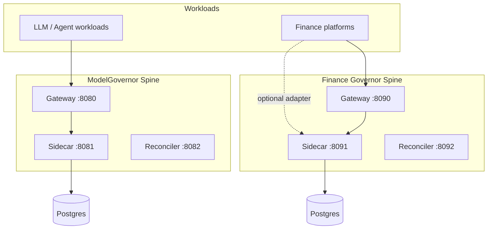

# Finance Governor Spine — Architecture

Canonical specification for the **Finance Governor spine** — a ModelGovernor-parallel control plane adapted for regulated finance and centered on the **Crystal Commit Protocol (CCP)**.

## Overview

The Finance Governor spine separates **financial action routing** from **governance state**:

- **Gateway** normalizes finance platform requests and orchestrates crystallize → act → commit.
- **Ledger sidecar** enforces CCP, exposure reservation, crystal-bound commit, and replay protection.
- **Postgres** is the exact-decimal ledger, crystal chain, and audit system of record.
- **Redis** provides volatile runtime guardrails only (rate limits, diagnostic flag, circuit breaker).
- **Reconciler** sweeps expired commit horizons, strands ambiguous outcomes, runs `regulatory_ops` + `crystal_ops` audit.

## Sibling relationship to ModelGovernor



| Aspect | ModelGovernor | Finance Governor spine |
|--------|---------------|------------------------|
| **Unit of control** | Token / request cost | Exposure, notional, commit authorization |
| **Pre-action primitive** | Reserve | **Crystallize** (+ optional reserve) |
| **Terminal primitive** | Settle | **Commit** (crystal-bound) |
| **Ambiguous outcome** | STRANDED | STRANDED (Commit Horizon) |
| **Policy registry** | Model allowlist | Instrument + jurisdiction + risk tier |
| **Unique IP** | Adaptive Reservation Sizing | **CCP** + Adaptive Crystal Sizing |
| **Attribution** | tenant, session, agent_run | + desk, book, application_id |
| **Audit chain** | ledger_events | governance_crystals + decision_events |

Both spines share: idempotency, append-only events, hash chain, diagnostic mode, reconciler leader election, 4-tier CI target, K8s HA patterns.

---

## Trust boundaries

- Finance platforms and workloads do not commit irreversible actions without spine authorization (when spine-enabled).
- All governance state transitions occur inside Postgres transactions.
- Redis is never the source of truth for balances, crystals, or commit state.
- Terminal commit uses authoritative platform outcome where available (rail confirmation, fill report, score).

---

## Request lifecycle

### 1. Crystallize before action

1. Platform or gateway sends operation metadata to sidecar `POST /crystallize`.
2. Sidecar validates internal auth, schema, instrument policy, jurisdiction.
3. Sidecar checks Redis guardrails (desk rate limit, concurrent in-flight).
4. Sidecar selects conservative or **adaptive crystal sizing** for exposure reservation.
5. Postgres transaction:
   - Enforce idempotency (`operation_id` + fingerprint)
   - Insert `governance_crystals` row with facets + `horizon_expires_at`
   - Optionally debit `account_ledgers` and update `exposure_budget_state`
   - Insert `commit_escrow_ledger` row `CRYSTALLIZED`
   - Append `CRYSTAL_CREATED` to `decision_events`
6. Platform acts only after crystallize commit succeeds.

### 2. In-flight action

1. Platform executes (order egress, wire send, credit score, IC match, depreciation).
2. Platform records attempt in `platform_action_attempts` (optional).
3. Status → `IN_FLIGHT`; timeout → `ACTION_TIMEOUT` (not terminal failure).

### 3. Crystal-bound commit

1. Platform or gateway calls `POST /commit` with `crystal_id` and outcome.
2. Sidecar locks escrow row; verifies crystal valid, horizon, fingerprint match.
3. Computes exposure drift; material drift → account lock + `DRIFT_ENFORCED`.
4. Append `COMMITTED_FINAL` or `RECONCILED_LATE_COMMIT`.
5. Set crystal `terminal_state = COMMITTED`.

### 4. Horizon expiry and repair

1. Reconciler claims crystals past `horizon_expires_at` (`FOR UPDATE SKIP LOCKED`).
2. Never-acted + low-risk → `EXPIRED` + exposure refund (if policy allows).
3. Critical/high risk or in-flight → `STRANDED`; retain hold.
4. Append reason-coded events only — never rewrite history.
5. Post-sweep: `assert_regulatory_ops_invariants()` + `assert_crystal_ops_invariants()`.

---

## Sidecar API surface

### Mutation (internal token)

| Endpoint | Purpose |
|----------|---------|
| `POST /crystallize` | Create crystal + optional exposure reserve |
| `POST /commit` | Crystal-bound terminal commit |
| `POST /adjudicate` | Resolve STRANDED (compliance role) |
| `POST /reserve` | Exposure-only reserve (without full crystallize — spine-lite) |

### Read (internal token + OIDC RBAC)

| Endpoint | Purpose |
|----------|---------|
| `GET /internal/account/{id}` | Ledger balance and lock posture |
| `GET /internal/commit/{operation_id}` | Escrow state + crystal link |
| `GET /internal/crystals/{crystal_id}` | Crystal facets + horizon |
| `GET /internal/crystals/{id}/reconstruct` | Forensic reconstruction bundle |
| `GET /internal/crystals/verify-chain` | Hash chain integrity |
| `GET /internal/exposure/{scope_key}` | Desk/book/day caps |
| `GET /internal/events/recent` | Append-only audit |
| `GET /internal/attribution/summary` | By desk, book, platform, model |
| `GET /internal/guardrail/incidents` | Approval, mesh block, bias |
| `GET /internal/regulatory/export` | Examiner pack |
| `GET /internal/diagnostic/status` | Write-halt state |
| `GET /metrics/prometheus` | SLO + invariant counters |

### Gateway surface

| Endpoint | Purpose |
|----------|---------|
| `POST /governed/commit` | Full crystallize → platform callback → commit |
| `POST /v1/decisions/{instrument}` | Instrument-specific normalized API |
| `POST /platforms/{name}/proxy` | Authenticated platform proxy |

---

## Core tables (spine schema)

| Table | Purpose |
|-------|---------|
| `governance_crystals` | CCP envelope — facets, horizon, hash chain |
| `commit_escrow_ledger` | Per-operation state machine |
| `decision_events` | Append-only audit + row hash |
| `account_ledgers` | Exposure / nostro / fee balances |
| `exposure_budget_state` | Atomic desk/book/tenant caps |
| `instrument_policy_registry` | Model, jurisdiction, risk tier, horizons |
| `platform_registry` | Registered platforms + auth tokens |
| `platform_action_attempts` | Multi-attempt action log |
| `crystal_mesh_rules` | Cross-platform parent→child blocks |
| `guardrail_incidents` | Mesh block, approval, bias |
| `admin_audit_log` | Privileged mutations |
| `decision_chain_anchors` | S3 external anchor heads |

See `finance-governor/migrations/0001_fg_spine_init.sql` and [domain-model.md](domain-model.md).

---

## Finance-specific spine modules

| Module | ModelGovernor source | Finance role |
|--------|---------------------|--------------|
| `crystal.py` | `ledger_seal.py` + new | Crystallize, seal, verify |
| `commit_ledger.py` | `ledger.py` | Escrow state machine |
| `regulatory_ops.py` | `finance_ops.py` | Balance, cap, duplicate probes |
| `crystal_ops.py` | new | Surprise budget, horizon, mesh probes |
| `exposure_budget.py` | `trace_budget` logic in ledger | Atomic caps |
| `crystal_mesh.py` | new | Parent crystal blocks child commit |
| `currency.py` | `money.py` | ISO 4217 quantum |
| `adaptive_crystal.py` | adaptive reservation | Statistical exposure sizing |
| `routes_crystallize.py` | `routes_reserve.py` | CCP entry |
| `routes_commit.py` | `routes_settle.py` | CCP terminal |
| `horizon_sweeper.py` | `sweeper.py` | Strand on expiry |

---

## Crystal Mesh (spine-only)

Stored in `crystal_mesh_rules`:

```sql
-- Example: no wire commit while desk algo crystal is FROZEN
INSERT INTO crystal_mesh_rules (parent_platform, parent_facet_key, parent_facet_value,
    child_platform, block_commit)
VALUES ('algofreeze', 'freeze_state', 'FROZEN', 'wire_match', TRUE);
```

Enforced in `commit()` before terminal state — increments `crystal_mesh_block_total` on violation.

---

## Invariants (spine)

### CCP (zero error budget)

| Invariant | Counter |
|-----------|---------|
| No commit without crystal | `surprise_commit_blocked_total` |
| Crystal fingerprint match at commit | `crystal_fingerprint_mismatch_total` |
| Critical/high horizon → strand not guess | `crystal_horizon_strand_total` |
| Mesh rule violation blocked | `crystal_mesh_block_total` |

### Regulatory (zero error budget)

| Invariant | Counter |
|-----------|---------|
| Negative account balance | `negative_balance_detected_total` |
| Exposure cap overrun | `exposure_cap_overrun_detected_total` |
| Duplicate commit | `duplicate_commit_anomaly_total` |
| High-risk silent expire | `high_risk_auto_expired_total` |
| Post-sweep audit failure | `regulatory_audit_violation_total` |

---

## Deployment

### Local (spine only)

```bash
cd finance-governor
docker compose up -d   # postgres, redis, fg-sidecar, fg-reconciler, fg-gateway
```

### With platform

```yaml
# docker-compose.override.yml
services:
  algofreeze:
    environment:
      FG_SPINE_ENABLED: "true"
      FG_SIDECAR_URL: http://fg-sidecar:8091
```

### Production

Port ModelGovernor `deploy/` kit:
- Namespace: `financegovernor`
- Metric prefix: `financegovernor_*`
- PrometheusRule alerts: `FinanceGovernorCrystalHorizonStrand`, etc.
- Same HA: PgBouncer, Redis Sentinel, Istio enterprise overlay

---

## SLOs (spine)

| SLI | Target |
|-----|--------|
| `/crystallize` success rate | 99.5% / 30d |
| `/crystallize` p95 latency | ≤ 500ms |
| `/commit` success rate | 99.5% / 30d |
| Horizon strand correctness | 100% (invariant, not SLO) |

---

## Implementation phases

| Phase | Spine deliverable |
|-------|-------------------|
| **2a** | Sidecar: crystallize, commit, local crystal_ops |
| **2b** | Reconciler: horizon sweeper |
| **2c** | Gateway: governed commit orchestration |
| **2d** | Hash chain verify + diagnostic mode |
| **3** | K8s deploy kit, S3 anchor, mesh rules |
| **4** | `make fg-spine-demo` + `make crystal-demo` |

---

## Related

- [crystal-commit-protocol.md](crystal-commit-protocol.md)
- [platform-model.md](platform-model.md)
- [spine-port-map.md](spine-port-map.md)
- [../finance-governor/spine/README.md](../finance-governor/spine/README.md)
- ModelGovernor: [architecture.md](../architecture.md), [institutional-reliability.md](../institutional-reliability.md)
