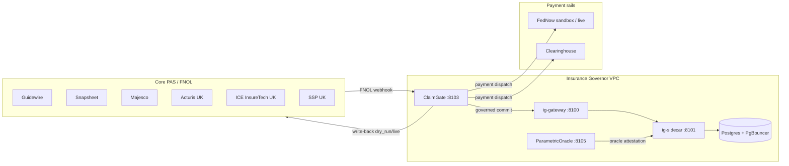

# Integration architecture — Insurance Governor

End-to-end integration map for carrier/MGA production deployments.

## Topology



## FNOL ingest (read path)

| Vendor | Endpoint | Adapter |
|--------|----------|---------|
| Guidewire | `POST /claim/fnol/webhook` | `from_guidewire` |
| Snapsheet | same | `from_snapsheet` |
| Majesco | same | `from_majesco` |
| Acturis (UK) | same | `from_acturis` |
| ICE InsureTech (UK) | same | `from_ice` |
| SSP (UK) | same | `from_ssp` |

All vendors normalize to `NormalizedFnol` → single payout evaluation → spine crystallization.

## FNOL write-back (govern path)

| Vendor | Env | Mode |
|--------|-----|------|
| Guidewire | `GUIDEWIRE_WRITEBACK_URL`, `GUIDEWIRE_API_TOKEN` | `FNOL_WRITEBACK_MODE=live` |
| Acturis | `ACTURIS_WRITEBACK_URL` | `FNOL_WRITEBACK_MODE=live` |
| ICE | `ICE_WRITEBACK_URL`, `ICE_API_TOKEN` | `FNOL_WRITEBACK_MODE=live` |

Default: `FNOL_WRITEBACK_MODE=dry_run` — records intent without outbound HTTP.

## Payment rails

| Mode | Env | Use |
|------|-----|-----|
| `stub` | — | Unit tests |
| `fednow_sandbox` | `FEDNOW_SANDBOX_URL`, `BANK_RAIL_API_TOKEN` | Staging rehearsal |
| `fednow` | Production FedNow credentials | Live payouts |
| `clearinghouse` | Clearinghouse API | ACH batch |

Idempotency keys persist in `payment_idempotency` (Postgres).

## Oracle feeds

| Provider | Source | Gate |
|----------|--------|------|
| USGS | Live HTTP | `sha256(source:payload)` attestation |
| NOAA | Live HTTP | same |
| Chainlink | On-chain read | same |

## Security

- **Istio mTLS** between all platform pods (`deploy/helm/insurancegovernor/istio-enterprise.yaml`)
- **Internal tokens** on sidecar admin routes
- **Fail-closed** platform manifest — unregistered platforms cannot commit

## Rehearsal

```bash
make ig-full-rehearsal
```

Produces published data-room artifacts under `docs/insurance-governor/data-room/published/`.
