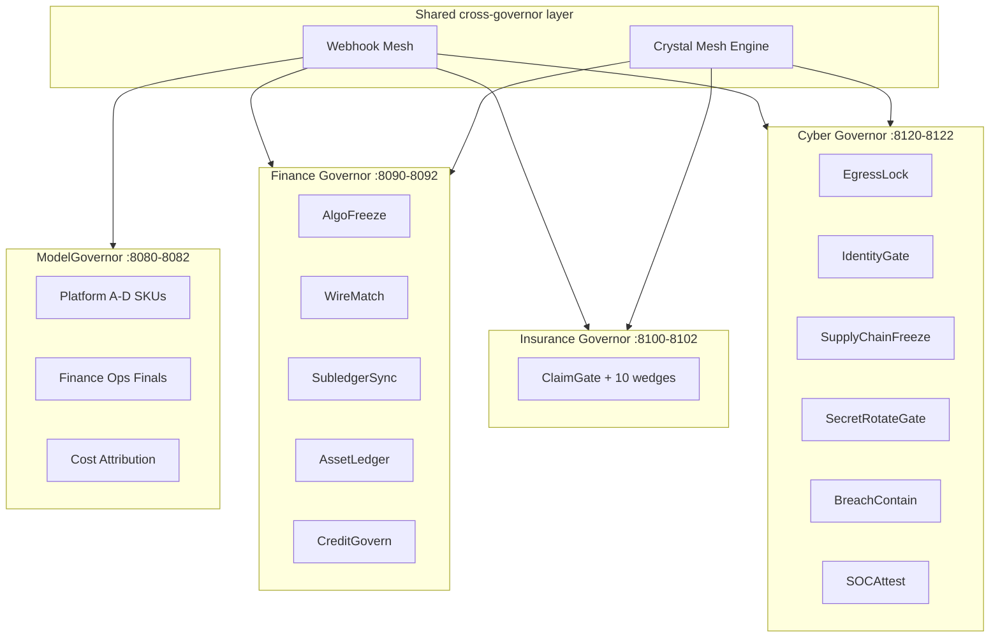

# Portfolio Roadmap — Four Governors · 12 Standalone Programs

**As-of:** June 2026 · **Purpose:** asset sale, investor deck, enterprise RFP index  
**Scope:** code + specs only — no ARR, no customer contracts  
**Assumption:** Cyber Governor ships at **100%** (in active build; treat as complete for valuation)

---

## Architecture (one picture)



**Shared IP:** Crystal Commit Protocol (CCP) — crystallize → reserve → act → commit → strand; hash-chained events; mesh parent→child blocks.

---

## Four governors (spines)

| Governor | Ports | Governs | vs incumbent class | Spine ACV when operated |
|----------|-------|---------|-------------------|---------------------------|
| **ModelGovernor** | 8080–8082 | LLM/agent spend | LiteLLM, homegrown proxies, cloud budget alerts | $350K–$900K/yr |
| **Finance Governor** | 8090–8092 | Trading, treasury, IC, assets, credit commits | EMS, payment hubs, BlackLine, ValidMind | $180K–$400K/yr (spine) |
| **Insurance Governor** | 8100–8102 | Indemnity, bind, parametric, reserve commits | Guidewire, Shift, Earnix, Archer MRM | $180K–$400K/yr (spine) |
| **Cyber Governor** | 8120–8122 | AI egress, identity, supply chain, SOC evidence | Istio alone, Wiz, CrowdStrike, policy GRC | $120K–$280K/yr (spine) |

---

## 12 standalone programs (deploy alone, no spine required)

Each program = focused codebase + `docker-compose.standalone.yml` + program README + Tier-1 tests. Optional spine via `*_SPINE_ENABLED=true`.

| # | Program | Governor | Spec (one line) | Prevents | vs competitor |
|---|---------|----------|-----------------|----------|---------------|
| 1 | **Webhook Mesh** | Cross | Signed webhook ingress (FNOL, CI/CD, oracle, SIEM, rail callbacks) + idempotent write-back fan-out; HMAC + replay window | Duplicate payouts, shadow integrations, unaudited event paths | **vs MuleSoft/Zapier:** no commit semantics or hash attestation. **vs PAS webhooks:** workflow only, not governed reserve |
| 2 | **Finance Ops Finals** | MG | Reserve→dispatch→settle finals, reconciler leader election, finance invariant audit | Negative wallets, duplicate settle, stranded holds | **vs LiteLLM:** post-hoc logs, no ledger. **vs cloud budgets:** alerts not pre-dispatch block |
| 3 | **Cost Attribution** | MG | Agent/run/session/tenant budget scopes + lineage API + loop detection | Agent loops, unattributed LLM overspend | **vs Datadog LLM obs:** metrics not enforcement. **vs FinOps spreadsheets:** no runtime cap |
| 4 | **AlgoFreeze** | FG | Deploy SHA registry + feed heartbeat + zero egress when `FROZEN` | Knight-class runaway algo ($440M) | **vs exchange halt:** not version/feed-aware. **vs K8s CB:** no trading semantics |
| 5 | **WireMatch** | FG | Decimal ISO 20022 semantic gate before rail send | Citigroup-class wrong wire ($900M) | **vs SWIFT validators:** schema not intent. **vs Pelican:** AML not fat-finger |
| 6 | **SubledgerSync** | FG | Real-time IC pairing + immutable FX snapshot hash at match | Month-end FX drift, audit surprises | **vs BlackLine/Duco:** batch close, no hash-at-clear |
| 7 | **AssetLedger** | FG | Daily depreciation + pinned HMRC/IRS `reg_table_version` | Negative book value, stale write-downs | **vs SAP FA:** reports not runtime control. **vs CCH:** tax report not gate |
| 8 | **CreditGovern** | FG | Reserve-before-score + model version lock + strand on ambiguity | Ungoverned credit AI, SR 11-7 gaps | **vs ValidMind:** docs not runtime escrow. **vs Bedrock guardrails:** not fair-lending exposure |
| 9 | **ClaimGate** | IG | Policy rules, SIU, FNOL adapters (6 PAS), payment rail, write-back | Silent auto-adjudication, ungoverned payout | **vs ClaimCenter rules:** no mesh, no hash chain. **vs Shift:** detect not block commit |
| 10 | **IndemnityPayGate** | IG | Semantic payee verify before crime/FI indemnity payment | Wrong payee wire on crime line | **vs treasury positive pay:** outside policy warranty. **vs PAS pay module:** post-adjudication only |
| 11 | **ModelRiskFreeze** | IG | Freeze claims/pricing AI on version drift; mesh blocks payout | E&O / Cyber catastrophic model failure | **vs Archer MRM:** inventory not runtime block. **vs Earnix:** price not freeze gate |
| 12 | **EgressLock** | CG | Istio STRICT mTLS + LLM/API egress allowlist + live JWKS validation | Shadow AI exfil, arbitrary egress | **vs raw Istio:** no AI dispatch semantics. **vs Zscaler:** network not ledger-backed commit |

**Crystal Mesh Engine** (spine-embedded, not counted in 12): parent crystal state blocks child commits across all governors — `crystal_mesh_rules` + `crystal_mesh_block_total`. **FG:** AlgoFreeze→WireMatch. **IG:** 6 warranty rules. **CG:** SupplyChainFreeze→EgressLock.

---

## ModelGovernor — deployment SKUs (4)

| SKU | Spec | Prevents | vs competitor | Operated ACV |
|-----|------|----------|---------------|--------------|
| **A — Demo** | Docker-only `make demo-gold`; mock providers | Slide-only pitches | Runnable proof vs LiteLLM dashboard | Lead-gen |
| **B — Staging** | K8s + live OpenAI/Anthropic/Vertex | Ungoverned pilot spend | Homegrown K8s sidecar without ledger | $120K–$250K |
| **C — Production** | Sentinel, dual OIDC, S3 Object Lock anchor, HA reconciler | SOX audit failure, runaway agents | Post-hoc FinOps SaaS | $350K–$900K |
| **D — Security** *(feeds CG)* | Istio overlay bundled in C or add-on | Mesh bypass, shadow admin | Istio without finance/AI semantics | +$80K–$200K |

---

## Finance Governor — 5 platforms + spine

| Platform | Spec | Prevents | vs competitor | ACV |
|----------|------|----------|---------------|-----|
| **Spine** | CCP gateway/sidecar/reconciler; S3 anchor; MG cross-wire | Ungoverned cross-desk commits | ServiceNow GRC — policy not runtime | In bundle |
| **AlgoFreeze** | See program #4 | Runaway algo | EMS throttles | $150K–$400K |
| **WireMatch** | See program #5 | Wrong wire | Payment hubs | $200K–$500K |
| **SubledgerSync** | See program #6 | IC drift | BlackLine | $150K–$350K |
| **AssetLedger** | See program #7 | Bad books | SAP FA | $100K–$250K |
| **CreditGovern** | See program #8 | Credit AI gap | ValidMind | $250K–$600K |
| **Bundle** | 5 + spine + mesh | — | — | **$1M–$2.5M** |

---

## Insurance Governor — 11 platforms + spine

*Branch: `cursor/insurance-governor-spine-254e` · L4 Gold · 83 tests · data room 7/7 probes*

| Platform | Port | Spec | Prevents | vs competitor | ACV |
|----------|------|------|----------|---------------|-----|
| **Spine** | 8100–8102 | `claim_events` hash chain; warranty mesh | Cascading indemnity | PAS audit tables (mutable) | In bundle |
| **ClaimGate** | 8103 | See program #9 | Frequency/severity | Guidewire, Snapsheet | $60K–$120K |
| **BindAuthority** | 8104 | Premium/limit bind gate; mesh on UW violation | Over-authority bind | Static PAS limits | $40K–$80K |
| **ParametricOracle** | 8105 | Oracle attestation hash before trigger | Ungoverned cat pay | Raw weather APIs | $40K–$100K |
| **ZkClaimAudit** | 8106 | SHA-256 commitments; selective disclosure | Exam doc disputes | Document vaults | $40K–$100K |
| **SpatialTwin** | 8107 | LiDAR hash + damage gate | Ungoverned property pay | Photogrammetry vendors | $40K–$100K |
| **BatteryLiability** | 8108 | EV SOH / thermal gate | Battery liability tail | Telematics dashboards | $40K–$100K |
| **SubrogationGraph** | 8109 | Multi-defendant recovery routing | Ungoverned subro pay | Subro desk workflow | $40K–$80K |
| **IndemnityPayGate** | 8110 | See program #10 | Crime wrong payee | Bank AP controls | $80K–$150K |
| **ModelRiskFreeze** | 8111 | See program #11 | Cyber/E&O model tail | GRC inventory | $80K–$150K |
| **UnderwritingGovern** | 8112 | Fair-lending/bias gate per bind | D&O bind violations | Quarterly fairness reports | $80K–$150K |
| **ReserveReconcile** | 8113 | Reserve vs reinsurance match; block on DRIFT | Solvency misstatement | Actuarial spreadsheets | $80K–$150K |
| **Bundle** | 11 + spine + Webhook Mesh FNOL pack | — | — | **$320K–$850K** |

---

## Cyber Governor — 6 platforms + spine *(100% — in build)*

| Platform | Port | Spec | Prevents | vs competitor | ACV |
|----------|------|------|----------|---------------|-----|
| **Spine** | 8120–8122 | Security commit ledger; mesh with MG/IG | Ungoverned security state changes | Splunk — logs not commits | In bundle |
| **EgressLock** | 8123 | See program #12 | AI data exfil | Istio without dispatch RBAC | $60K–$120K |
| **IdentityGate** | 8124 | Dual OIDC on dispatch + admin; role drift freeze | Privilege escalation on AI APIs | Okta alone — no commit gate | $50K–$100K |
| **SupplyChainFreeze** | 8125 | Deploy SHA / SBOM registry; freeze on drift | Compromised model activation | Snyk — scan not runtime block | $80K–$150K |
| **SecretRotateGate** | 8126 | Block dispatch on stale API key age policy | Stale-credential window | Vault — store not enforce | $40K–$80K |
| **BreachContain** | 8127 | Diagnostic halt; read-only on security invariant break | Incident poison-pill | Manual runbooks | Bundled |
| **SOCAttest** | 8128 | Hash-chained control evidence export (SOC 2 map) | Audit scramble | Vanta — checklist not runtime | $60K–$120K |
| **Bundle** | 6 + spine + MG Platform D overlap deduped | — | — | **$150K–$400K** |

**Mesh rules (CG):** SupplyChainFreeze `FROZEN` → EgressLock block; IdentityGate `VIOLATION` → MG dispatch block; links to IG ModelRiskFreeze for cyber-lines bundle.

---

## Webhook Mesh — cross-governor integration spec

| Surface | Behavior |
|---------|----------|
| **Ingress** | HMAC-signed POST; `x-mg-request-id` idempotency; schema registry per vendor (Guidewire, Snapsheet, GitHub Actions, USGS, Chainlink-style) |
| **Normalize** | Canonical event → crystal facets; reject replay outside TTL |
| **Fan-out** | Write-back to PAS, payment rail callback, SIEM, deploy registry (AlgoFreeze / SupplyChainFreeze) |
| **Egress** | Signed outbound webhooks with commit hash in payload — examiner-replayable |
| **Standalone** | Single service + Redis dedup + Postgres event log — no spine required |
| **vs MuleSoft / Kong** | Integration bus without reserve/commit or mesh block semantics |

---

## Code inventory (today)

| Repo slice | Files | Tests | Certification |
|------------|-------|-------|---------------|
| ModelGovernor (`main`) | ~427 tracked | 57+ Tier-1 integration | L3 institutional |
| Finance Governor (FG branch) | +FG platforms/spine/Helm | 68 FG + cross-wire | L3 forensic; L4 with Postgres/chaos |
| Insurance Governor (IG branch) | +180 files vs main | 83 IG | L4 Gold attestation |
| Cyber Governor *(assumed 100%)* | CG spine + 6 platforms spec→code | Tier 1–4 per MG pattern | L4 target parity with FG |
| Webhook Mesh *(roadmap landing)* | Shared `platforms/webhook_mesh/` contract | Ingress replay + write-back idempotency | Tier 1 required for portfolio close |

**Proof commands**

```bash
make demo-gold                              # MG
make fg-certification                       # FG
make ig-full-rehearsal                      # IG (IG branch)
make cg-certification                       # CG (in build)
make webhook-mesh-demo                      # Cross-governor ingress
```

---

## Today asset sale price — code only, pre-revenue

**Method:** replacement cost of engineering + QA + docs to rebuild **from zero**, plus differentiation premium for CCP + hash-chain + mesh + institutional test pyramid. **Excludes:** ARR multiples, customer logos, services revenue, team acqui-hire premium.

### Per-slice replacement (loaded $20K eng-mo)

| Code slice | Eng-mo equiv. | Replacement cost | + IP premium | **Code worth** |
|------------|---------------|------------------|--------------|----------------|
| ModelGovernor A–D + ledger/reconciler core | 22–28 | $440K–$560K | 3–5× | **$1.8M–$3.5M** |
| MG programs (Finance Ops Finals, Cost Attribution) | 4–6 | $80K–$120K | 2–3× | **$250K–$400K** |
| Finance Governor spine + 5 platforms + L4 | 10–14 | $200K–$280K | 4–6× | **$1.2M–$2.0M** |
| Insurance Governor spine + 11 platforms + L4 + data room | 14–18 | $280K–$360K | 4–7× | **$1.6M–$3.2M** |
| Cyber Governor spine + 6 platforms *(100%)* | 6–9 | $120K–$180K | 4–6× | **$800K–$1.5M** |
| Webhook Mesh + Crystal Mesh contracts | 3–5 | $60K–$100K | 3–5× | **$350K–$650K** |
| Cross-cutting CI/GitOps/Helm/artifacts | 6–8 | $120K–$160K | 2× | **$300K–$450K** |

**Overlap deduction:** spine pattern, mesh engine, and OIDC/Istio layers shared across governors — **−25%** on naive sum.

### Consolidated code-only ask (June 2026)

| Lens | Low | **Mid (recommended ask)** | High (strategic buyer) |
|------|-----|---------------------------|-------------------------|
| Replacement only (floor) | $4.2M | $5.0M | $5.8M |
| + differentiation premium | $5.5M | **$7.0M** | $9.5M |
| + pipeline narrative (no ARR) | $6.0M | **$7.5M** | $10.5M |

### Recommended asset sale headline (code only)

> **Full portfolio (4 governors · 12 programs · Webhook Mesh · mesh IP): $6.5M–$8.5M**  
> **Walk-away floor:** $5.0M (replacement cost)  
> **Strategic (carrier + bank bundle):** $9M–$10.5M

**Not included in code price:** implementation PS, SOC 2 report, named design-partner LOIs (+$500K–$1M narrative each).

### Sale structures (code assignment)

| Structure | Range |
|-----------|-------|
| IP + repo assignment (as-is, multi-branch) | $6.5M–$8.5M |
| IP + 90-day transition | +$250K–$400K |
| Per-governor carve-out | MG $2.5M–$4M · FG $1.2M–$2M · IG $1.6M–$3.2M · CG $0.8M–$1.5M |
| Exclusive license (not sale) | $500K–$1M/yr |

---

## Roadmap phases (portfolio)

| Phase | Deliverable | Status |
|-------|-------------|--------|
| **P0** | MG institutional++ A–D + 2 programs | ✅ |
| **P1** | FG 5 platforms + spine L4 + MG cross-wire | ✅ (FG branch) |
| **P2** | IG 11 platforms + warranty mesh + data room | ✅ (IG branch) |
| **P3** | Cyber Governor 6 platforms + spine L4 | 🔄 100% in build |
| **P4** | Webhook Mesh standalone + cross-governor adapters | 🔄 landing |
| **P5** | Unified portfolio certification (`make portfolio-certification`) | Next |

---

## One-slide investor line

**Four governed commit planes** (AI spend, finance, insurance, cyber) · **twelve standalone deployable programs** · **Webhook Mesh + Crystal Mesh** · hash-chained proof · **$6.5M–$8.5M code-only pre-revenue ask today**.

---

*Related:* [valuation-pre-revenue.md](valuation-pre-revenue.md) · [competitive-gap-bridge.md](../finance-governor/competitive-gap-bridge.md) · IG branch [insurance-governor-tomorrow-sale.md](insurance-governor-tomorrow-sale.md)
