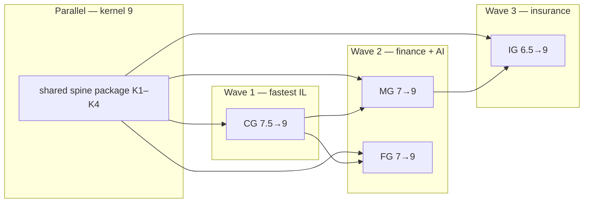

# Roadmap — Four Governors to 9/10 Industry Leading + 10/10 Enterprise Vendor

**Today (implementation scores):** [operational-architecture-scorecard.md](operational-architecture-scorecard.md)

---

## Full tier ladder (all governors)

```
10/10  EV  Gold-Standard Enterprise Vendor     SOC2 + SLA + references + vendor contracts
 9/10  IL  Industry Leading Gold Standard      L4+L5+live CI+demo+external evidence
 8.5    —  Engineering ceiling (code only)       Phase A+B complete, no design partner
 7–8   L5  Institutional Self-Check Certified   make plug + portfolio-plug CI
 6–8   L4  Gold Enterprise                       *-certification-l4-ci per governor
```

| Tier | MG | FG | CG | IG | Portfolio |
|------|----|----|----|----|-----------|
| **Today** | 7.5 | 7.0 | **8.5** | **8.0** | **7.5** |
| **After Wave 0** (items 1–4) | 7.5 | 7.0 | **8.5** | 6.5 | **7.0** |
| **After Wave 1+3** (live CI all governors + K1/K2) | 7.5 | 7.0 | **8.5** | **8.0** | **7.5** |
| **After Phase A+B** (IL rubric engine + FG hero CI) | **8.5** | **8.5** | **8.5** | **8.5** | **8.5** |
| **IL 9/10** (+ Phase C each) | 9.0 | 9.0 | 9.0 | 9.0 | **9.0** |
| **EV 10/10** (+ company) | 10 | 10 | 10 | 10 | **10** |

See [maturity-ladder.md](maturity-ladder.md) for EV vs IL definitions.

---

## Wave 0 — immediate engineering (items 1–4)

Highest ROI on path to **8.5 code / CG first IL candidate**.

| # | Item | Governor | Deliverable | Status |
|---|------|----------|-------------|--------|
| **1** | Mesh 409 in live demo | **CG** | `cg-egress-wedge-demo.sh` step 5 | ✅ Shipped |
| **2** | Compose smoke in CI | **CG** | CI job `compose-smoke-cg` | ✅ Shipped |
| **3** | Shared spine contract (K1) | **Kernel** | `spine_core/ledger_contract.py` | ✅ Phase K1 scaffold |
| **4** | MG-ECP + L4 aggregator | **MG** | `certification/program.yaml` + `make mg-certification-l4-ci` | ✅ Shipped |

**Verify Wave 0:**

```bash
make cg-egress-wedge-demo    # requires CG stack — shows mesh 409
make compose-smoke-cg
make mg-certification-l4-ci
python3 -c "from spine_core.ledger_contract import LedgerSealer; print('K1 OK')"
```

**Wave 1 (shipped):** `compose-smoke-mg/fg`, `mg/fg-pilot-attestation`, `cg-pilot-attestation` in CI, K1 `ledger_registry`, K2 `portfolio_self_check.json`.

| # | Item | Governor | Deliverable | Status |
|---|------|----------|-------------|--------|
| **1** | CG pilot attestation in CI | **CG** | `compose-smoke-cg` → `cg-pilot-attestation` (`ATTESTATION_CI`) | ✅ Shipped |
| **2** | MG compose smoke + pilot | **MG** | `compose-smoke-mg` + `mg-pilot-attestation` + CI | ✅ Shipped |
| **3** | FG pilot attestation | **FG** | `compose-smoke-fg` + `fg-pilot-attestation` + CI | ✅ Shipped |
| **4** | K1 seal conformance | **Kernel** | `spine_core/ledger_registry.py` + tests | ✅ Shipped |
| **5** | K2 portfolio artifact | **Kernel** | `make plug` → `artifacts/portfolio_self_check.json` | ✅ Shipped |

**Verify Wave 1:**

```bash
make compose-smoke-mg && ATTESTATION_CI=1 make mg-pilot-attestation
make compose-smoke-fg && ATTESTATION_CI=1 make fg-pilot-attestation
make compose-smoke-cg && ATTESTATION_CI=1 make cg-pilot-attestation
make plug && test -f artifacts/portfolio_self_check.json
PYTHONPATH=governor-spine-core python3 -m pytest governor-spine-core/tests/test_ledger_conformance.py -q
```

---

## Next engineering — Kernel K3/K4 (Wave 2)

All four governors have live CI (Wave 1+3). **Next:** shared kernel items that lift spine from **8.5 → 9.0** code.

| # | Item | Deliverable | Status |
|---|------|-------------|--------|
| **K3** | Reconciler sweep hash-seal | Post-sweep events sealed on ledger chain; `unsealed_count == 0` after sweep | ✅ Shipped |
| **K4** | Retention / partition CronJob | Reads `*_retention_policy` tables; Helm CronJob template | ✅ Shipped |
| **M1** | Spine consolidation (thin shared modules) | `chain_checkpoint`, `metadata`, `commit_mesh`, `commit_helpers` in `spine_core`; governor shims | ✅ Shipped |

**Verify K3:**

```bash
PYTHONPATH=governor-spine-core python3 -m pytest governor-spine-core/tests/test_sweep_seal.py -q
make plug   # portfolio_self_check includes k3_sweep_seal row
```

**Verify K4 (target):**

```bash
helm template deploy/helm/modelgovernor | grep -i retention
```

Phase C (design-partner letters) runs **in parallel** per governor — human gate, not blocked on K3/K4.

---

## Wave 3 — Insurance Governor (IG → 8.0 code) ✅

Longest wedge path; hero = **ClaimGate + IG spine** (not 11 platforms).

| # | Item | Governor | Deliverable | Status |
|---|------|----------|-------------|--------|
| **1** | Compose smoke in CI | **IG** | `scripts/compose-smoke-ig.sh` — 8100–8103 + verify-chain | ✅ Shipped |
| **2** | Pilot attestation in CI | **IG** | `compose-smoke-ig` → `ig-pilot-attestation` (`ATTESTATION_CI`) | ✅ Shipped |
| **3** | FNOL sandbox integration | **IG** | `mock_pas_writeback_sandbox.py` + Guidewire/Snapsheet live writeback in smoke + `test_fnol_sandbox_integration.py` | ✅ Shipped |
| **4** | FedNow sandbox in CI | **IG** | `mock_fednow_sandbox.py` in compose-smoke + `test_fnol_sandbox_integration.py` rail probe | ✅ Shipped |
| **5** | Phase C external evidence | **IG** | Carrier design-partner letter + VPC attestation | ⏳ Human gate |

**Verify Wave 3:**

```bash
make compose-smoke-ig
ATTESTATION_CI=1 make ig-pilot-attestation
PYTHONPATH=insurance-governor python3 -m pytest insurance-governor/tests/test_fnol_sandbox_integration.py -q
make ig-certification-l4-ci   # includes sandbox integration tests
```

**Not claimed at 9/10:** SpatialTwin / SubrogationGraph are **7.5 governed evidence envelopes** with mock vendor connectors — production LiDAR/desk APIs remain carrier SOW. IL 9/10 for IG still requires ClaimGate hero + Phase C design-partner evidence.

---


## What 9/10 actually means (rubric)

A governor scores **9/10** only when **all five rows** are green:

| # | Dimension | 9/10 requires | Verified by |
|---|-----------|---------------|-------------|
| 1 | **L4 engineering** | Tier 1–4 CI green on `main` | `make *-certification-l4-ci` |
| 2 | **L5 self-check** | Portfolio plug includes governor | `make plug` (job `portfolio-plug`) |
| 3 | **Live stack proof** | Docker compose smoke + pilot attestation **in CI** | `compose-smoke-*`, `*-pilot-attestation` |
| 4 | **Hero wedge depth** | At least one defensible wedge shows end-to-end enforcement **in shell demo**, not pytest-only | Demo scripts + attestation JSON |
| 5 | **External evidence** | Design-partner signed letter **or** acquirer reference VPC attestation (no `probes_note` stub) | `attestation_validate.py` |

**9/10 does not require** (that's **10/10 vendor-of-record**):

- SOC 2 Type II (organization — partner or acquirer)
- 24×7 support SLA
- Turnkey replacement of Okta / Guidewire / BlackLine

**Portfolio 9/10** = all four governors ≥ 9/10 **plus** shared kernel package extraction (below).

---

## Architecture: three phases (all governors)

```
PHASE A — ENGINEERING 9/10     PHASE B — LIVE PROOF 9/10     PHASE C — IL EVIDENCE 9/10
(code + CI, no humans)          (Docker CI, demos)             (design partner / acquirer)
        │                                │                              │
        ▼                                ▼                              ▼
  L4 + plug + smoke CI            pilot-attestation CI          signed letter + live VPC JSON
  hero wedge demo parity          mesh 409 in shell demos       examiner pack archived
  shared spine_core package       compose-smoke per governor    reference customer (optional)
```

Estimated **engineering-only** path to **8.5→9.0** on code: Phase A + B.  
**9.0 Industry Leading claim** requires Phase C for that governor.

---

## Shared kernel (8.5 → 9.0) — lifts all four

| # | Deliverable | Unblocks |
|---|-------------|----------|
| K1 | **Shared spine Python package** — extract `commit_ledger` / seal / verify interfaces (thin); keep governor-specific tables | Single patch for kernel bugs; acquirer story |
| K2 | **`governor-spine-core` maturity artifact** — `make plug` emits `artifacts/portfolio_self_check.json` with scores + git SHA | Data room single file |
| K3 | **Reconciler sweep hash-seal** (MG P2 gap) | Examiner “no unsealed sweeps” — `spine_core.sweep_seal` | ✅ Shipped |
| K4 | **Retention / partition CronJob** reads `*_retention_policy` tables | Ops 9/10 credibility | ✅ Shipped |
| M1 | **Spine consolidation** — shared checkpoint, mesh, metadata modules | Single patch surface for CCP boilerplate | ✅ Shipped |

**Verify:** `make plug` + `python -m spine_core.port_checks` + shared package unit tests.

---

## ModelGovernor (7.0 → 9.0)

### Current strengths
- `make demo-gold`, reserve-before-dispatch, 4-tier CI, property + chaos tests.

### Gaps to 9/10

| Phase | Work | Exit criterion |
|-------|------|----------------|
| **A1** | Add `certification/program.yaml` (parity with FG/IG/CG) | MG-ECP manifest in repo |
| **A2** | `make mg-certification-l4-ci` aggregator on root Makefile + CI job name | Explicit MG L4 gate |
| **A3** | Deprecate `demo-up` → alias `demo-gold-up` in README/Makefile | One demo entrypoint |
| **B1** | `scripts/compose-smoke-mg.sh` + CI job (gateway 8080, verify-chain) | Live proof in GitHub |
| **B2** | `scripts/mg-pilot-attestation.sh` (reserve → dispatch → verify-chain → anchor) | Same pattern as CG |
| **C1** | One FinOps design-partner runs attestation in their VPC; archive JSON + redacted letter | `attestation_validate.py` pass |

### Hero wedge at 9/10
**MG-SPINE / Spend Guard** — already the product. Do not chase 12 MG catalog SKUs; depth on **reserve → settle → drift lockout** demo.

```bash
make demo-gold
make plug
make compose-smoke-mg          # Phase B
make mg-pilot-attestation      # Phase B
```

**MG 9/10 date realistic when:** B1+B2 in CI + one C1 artifact.

---

## Finance Governor (~7.0 → 9.0)

### Current strengths
- L4 CI (`fg-certification-l4-ci`), AlgoFreeze + WireMatch demos, FG-ECP self-attestation.

### Gaps to 9/10

| Phase | Work | Exit criterion |
|-------|------|----------------|
| **A1** | **Do not** lift SubledgerSync / AssetLedger to 9 without connector — label stays scaffold | Honest portfolio |
| **A2** | AlgoFreeze: CI integration test with frozen EMS mock + version mismatch → 409 | `test_algofreeze_integration.py` in L4 CI |
| **A3** | WireMatch: golden-record mismatch demo script shows HELD wire + chain row | `make wirematch-demo` in attestation |
| **A4** | CreditGovern: `FG_CREDIT_RAIL_MODE=live` HTTP rail contract test (mock server) | L5 overlay proof without buyer model |
| **B1** | `compose-smoke-fg.sh` — spine 8090–8092 + AlgoFreeze health | CI Docker job |
| **B2** | `fg-pilot-attestation.sh` — crystallize → commit → verify-chain | Parity with CG |
| **C1** | Treasurer or CRO design-partner letter + attestation JSON | External evidence |

### Wedge scoring target

| SKU | Today | 9/10 path |
|-----|-------|-----------|
| **FG spine** | 8.5 | B1+B2 |
| **AlgoFreeze** | 7.5 | A2 + live freeze in demo |
| **WireMatch** | 7.5 | A3 |
| **CreditGovern** | 6.0 | A4 only (scaffold → **7.5**, not 9, without buyer model) |
| **SubledgerSync / AssetLedger** | 6.0 | **Stay 6** or 18-month ERP SOW |

**FG governor 9/10** = spine + **two hero wedges** (AlgoFreeze, WireMatch) at 9 + Phase C — not all five platforms.

```bash
make fg-certification-l4-ci
make algofreeze-demo && make wirematch-demo
make fg-pilot-attestation    # Phase B
```

---

## Cybersecurity Governor (~7.5 → 9.0) — closest to target

### Current strengths
- Strongest post-#52: ext_authz, mesh pytest, L4 CI, port fix, Helm 9 platforms.

### Gaps to 9/10

| Phase | Work | Exit criterion |
|-------|------|----------------|
| **A1** | **Mesh 409 in `cg-egress-wedge-demo.sh`** — identity VIOLATION → egress commit blocked | Demo matches pytest story |
| **A2** | `compose-smoke-cg` in CI (Docker job on `main`) | Already scripted — wire CI |
| **A3** | `cg-pilot-attestation` in CI after compose-smoke | Full live gate automated |
| **A4** | Envoy sidecar compose profile: ext_authz → egress-govern:8123 | Edge enforcement demo |
| **B1** | Thin wedges (ThreatProxy, IRGate, ComplianceLogger) — document as **6.0 add-ons** in sales sheet only | No faux 9/10 on thin SKUs |
| **C1** | CISO design-partner: `make cg-pilot-attestation` in their VPC + examiner pack | External evidence |

### Hero wedge at 9/10
**CG-EGRESSLOCK** + TCP spine — identity arm → mesh 409 → ext_authz deny → verify-chain.

```bash
make cg-certification-l4-ci
make compose-smoke-cg
make cg-egress-wedge-demo    # after A1
make cg-pilot-attestation
```

**CG is the fastest path to first 9/10 governor** — A1+A2+A3 are small engineering.

---

## Insurance Governor (8.0 → 9.0) — Phase C remaining

### Current strengths
- L4 CI, ClaimGate depth, `ig-full-rehearsal`, mesh rules, 11 platforms in tree.

### Gaps to 9/10

| Phase | Work | Exit criterion |
|-------|------|----------------|
| **A1** | `compose-smoke-ig.sh` — 8100–8102 + ClaimGate 8103 health + verify-chain | CI Docker |
| **A2** | `ig-pilot-attestation.sh` — FNOL ingest → reserve → commit → verify-chain | Parity with CG |
| **A3** | One **sandbox** FNOL integration (Snapsheet or Guidewire mock server) — not just shape normalizer | Integration test in CI |
| **A4** | FedNow **sandbox** in CI (not manual `ig-rail-smoke` only) | Payment rail proof |
| **B1** | SpatialTwin / SubrogationGraph — **7.5** governed evidence envelope + mock vendor feed + demo/CI | Honest secondary wedges |
| **C1** | Carrier design-partner (MGA or Tier-2) + signed PoC letter | External evidence |

**Hero wedge at 9/10**
**ClaimGate + IG spine** — not 11 platforms. Lead with spine + ClaimGate; wedges are add-ons.

```bash
make ig-certification-l4-ci
make ig-full-rehearsal
make compose-smoke-ig         # Phase A1
make ig-pilot-attestation       # Phase A2
```

**IG 9/10** requires A3 (one live sandbox connector) — largest lift after CG.

---

## Portfolio 9/10 — sequencing



| Order | Governor | Why first | Key unlock |
|-------|----------|-----------|------------|
| **1** | **CG** | Already 7.5; mesh demo + compose CI | First IL reference story |
| **2** | **MG** | Acquirer knows ModelGovernor brand | FinOps design partner |
| **3** | **FG** | AlgoFreeze + WireMatch heroes | CRO/Treasurer letter |
| **4** | **IG** | Needs sandbox FNOL + rail CI | Carrier PoC |

**Parallel always:** kernel package (K1–K4) — without it, four forks cap spine at 8.5.

---

## Score projection after phases

| Governor | Today | After Phase A+B (code) | After Phase C (IL claim) |
|----------|-------|------------------------|--------------------------|
| Kernel | 8.5 | **9.0** (with K1–K4) | 9.0 |
| MG | 7.5 | **8.5** | **9.0** |
| FG | 7.0 | **8.5** | **9.0** |
| CG | 8.5 | **8.5** | **9.0** |
| IG | 8.0 | **8.0** | **9.0** |
| **Portfolio** | 7.5 | **8.5** | **9.0** |

Phase A+B alone gets **8.5 portfolio** — credible engineering ceiling.  
**9.0 Industry Leading** per governor requires **Phase C** external evidence per [maturity-ladder.md](maturity-ladder.md).

---

## Anti-patterns (do not do on path to 9/10)

| Action | Why it fails diligence |
|--------|------------------------|
| Rename docs to “Industry Leading” without Phase C | Same as deleted 92/100 files |
| Build 12 SKUs to 9/10 | Depth beats breadth; scaffolds stay 6 |
| Invent Lamport / mode_controller / kubectl failover | Rejected patterns |
| Claim SOC2 from `make plug` | L5 ≠ third-party audit |
| Merge draft PRs #48/#49 unreviewed | Reintroduces unaudited scores |

---

## Verification checklist (target end state)

```bash
# Portfolio
make plug && test -f artifacts/portfolio_self_check.json   # K2

# Per governor L4
make mg-certification-l4-ci   # A2 MG
make fg-certification-l4-ci
make cg-certification-l4-ci
make ig-certification-l4-ci

# Per governor live (Phase B)
make compose-smoke-mg           # MG B1
make compose-smoke-fg           # FG B1
make compose-smoke-cg           # CG A2
make compose-smoke-ig           # IG A1

# Per governor attestation (Phase B/C)
make mg-pilot-attestation
make fg-pilot-attestation
make cg-pilot-attestation
make ig-pilot-attestation

# External (Phase C) — human gate
python3 */scripts/attestation_validate.py artifacts/.../cluster_attestation.json
```

---

## Related

- [operational-architecture-scorecard.md](operational-architecture-scorecard.md) — today’s scores
- [forensic-audit-evidence.md](forensic-audit-evidence.md) — provable vs gap
- [maturity-ladder.md](maturity-ladder.md) — IL definition
- [GOVERNOR-PORTFOLIO.md](../../docs/sales-sheets/GOVERNOR-PORTFOLIO.md) — SKU honesty
